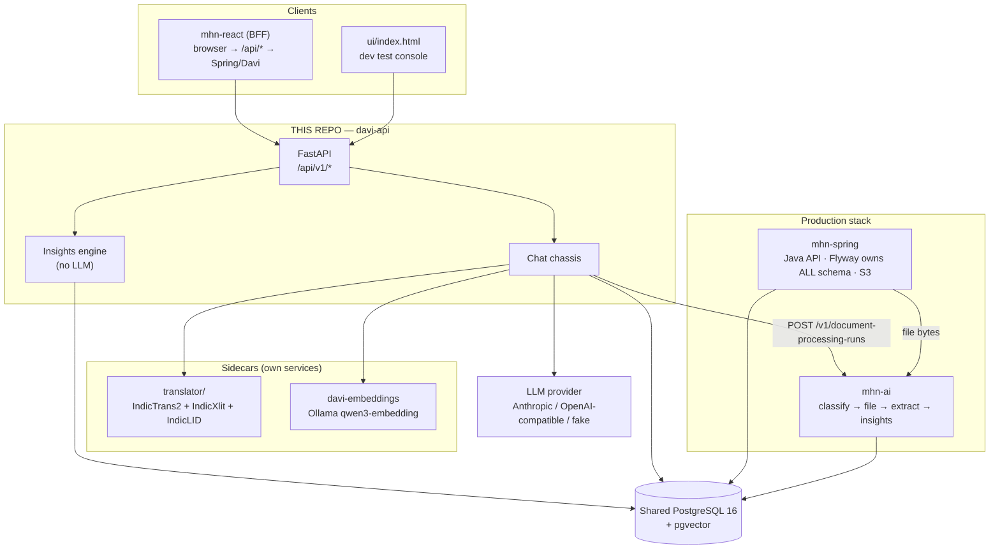
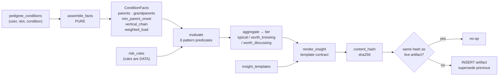
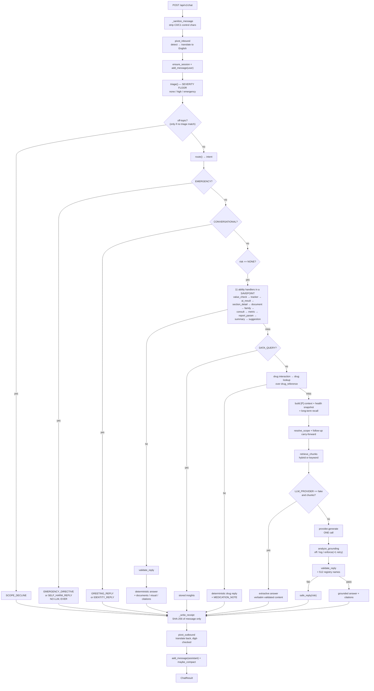
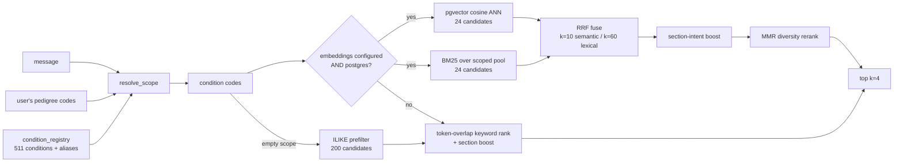
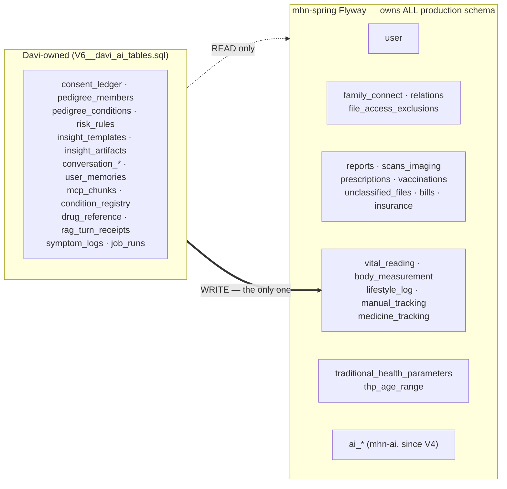
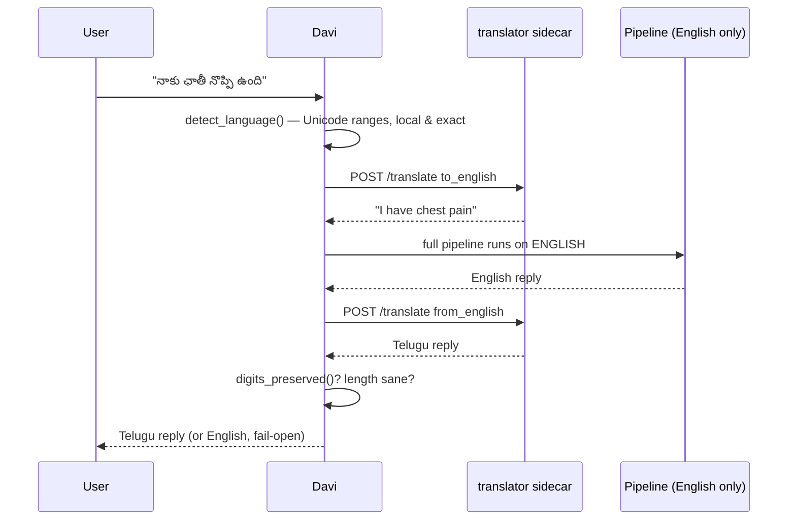

# Davi Health AI — Architecture

**Status:** as-built, verified against the code on branch `praveen-mhn` (commit `fee14d4`).
**Scope:** this repo (`MHN-AI-assitant-and-insights-V1`) plus its contracts with the
production stack (`mhn-spring`, `mhn-ai`, `mhn-react`).
**Companion document:** [`drawbacks.md`](./drawbacks.md) — gap analysis against an
August.ai-class conversational health assistant.

---

## 1. One-paragraph summary

Davi is a **decision-support** healthtech backend, not a diagnostic one, and that
constraint is enforced in code rather than in policy documents. It has two halves that
share a database and an auth model but share no logic: a **deterministic insights
engine** that turns family history into reproducible, hash-identified insight artifacts
with no LLM anywhere, and a **chat chassis** in which the LLM is the *last* component in
a pipeline of deterministic gates — red-flag triage, scope guard, intent routing, data
abilities, drug lookup — each of which can answer without ever reaching a model. Every
safety layer fails open to a canned safe reply rather than raising.

---

## 2. System context



**Davi holds no AWS credentials.** It never touches file bytes; it reads the extracted
`content.ai` JSON that mhn-ai already produced. Its blast radius is the database
permissions it runs with.

---

## 3. Layer map

```
app/
├── config.py            pydantic-settings — every knob is an env var
├── db.py                async engine (pool_pre_ping, pool_recycle=300) + get_db
├── auth.py              HS512 JWT (Base64-decoded secret) | SERVICE_TOKEN + X-User-Id
├── main.py              app factory, router wiring, dev console mount
│
├── api/v1/              health · pedigree · insights · chat · documents · schemas
│
├── insights/            ── HALF ONE: deterministic, no LLM ──
│   ├── constants.py     DRAFT clinical constants (onset midpoints, weights, copy)
│   ├── core.py          PURE stdlib: facts → 6 patterns → evaluate → render → hash
│   └── engine.py        recompute_insights — the ONLY DB-touching part
│
├── triage/red_flags.py  DRAFT phrase tables; the severity FLOOR
├── chat/                ── HALF TWO: the chassis ──
│   ├── orchestrator.py  handle_chat — the pipeline (854 lines)
│   ├── scope.py         off-topic decline
│   ├── router.py        deterministic intent routing
│   ├── abilities.py     PURE regex parsers (737 lines)
│   ├── data_handlers.py deterministic ability handlers (1380 lines)
│   ├── context.py       patient [P] block + personal health snapshot
│   ├── conversation.py  session/message persistence, compaction, context assembly
│   ├── memory.py        PURE compaction extractors + merge
│   ├── long_term.py     cross-session topic/flag memory
│   ├── validation.py    banned-phrase + escalation validator
│   └── replies.py       canned + safe replies (all validator-safe)
│
├── rag/                 retrieval (hybrid) · ranking (BM25+RRF+MMR) · embeddings
│                        · prompt (system prompt) · extractive (no-LLM answers)
├── grounding/claims.py  PURE marker parse/verify/strip
├── knowledge/           mcp_parser (docx → chunks) · registry (keyword index)
├── drugs/service.py     deterministic drug-info over drug_reference (~250K rows)
├── coredata/service.py  reads over Flyway tables + the ONE write (lifestyle_log)
├── documents/service.py mhn-ai processing-run trigger (no bytes, no rows)
├── health/              ranges.py (DRAFT constants) · reference.py (THP backend)
├── charts/svg.py        deterministic SVG line/bar charts
├── i18n/language.py     Unicode script-range detection + LLM language directive
├── translate/service.py English-pivot via the sidecar, digit-checked, fail-open
├── llm/                 LLMProvider protocol + agnostic httpx providers + fake
└── models/              common · core · rules · chat · knowledge · coredata · jobs
```

**Purity contract.** `insights/core.py`, `grounding/claims.py`, and `chat/memory.py`
are stdlib-only and side-effect free. No DB, no LLM, no randomness, no clock. They are
the parts that are 100%-testable and reproducible; keep them that way.

---

## 4. Half one — the insights engine

Family history in, versioned insight artifacts out. No model, no network, no randomness.



### The six patterns

| `pattern_key` | Fires when |
|---|---|
| `parental_count` | ≥ *min* affected parents |
| `both_parents` | mother **and** father affected |
| `grandparent_count` | ≥ *min* affected grandparents |
| `early_onset_parent` | any parent's onset midpoint < *lt* |
| `vertical_transmission` | a grandparent **and** that grandparent's own child |
| `premature_cad` | father < 55 or mother < 65 |

Rules live in the `risk_rules` table as data; only the predicates are code. That is what
lets a clinician change thresholds without a deploy.

### Key invariants

- **Reads never compute.** Only `recompute_insights` creates artifacts, and it runs only
  after a pedigree write or in the nightly sweep. `GET /insights` serves stored rows.
- **Stable identity.** `content_hash` covers `(facts_used, fired_rules, tier,
  template:version, body)`. Identical inputs produce no new row. A committed golden
  snapshot (`tests/golden/artifacts.json`) locks this.
- **Template contract.** A template without `{not_a_diagnosis}` and `{next_step}` raises
  `TemplateContractError` at render time — a missing safety section is a crash, not a
  degraded string.
- **Sensitive rules are held.** `sensitive → status="held_for_review"`, and the read
  endpoint filters to `status="active"` only.
- **Retraction.** A condition that stops producing an outcome has its live artifact
  superseded with no replacement.

---

## 5. Half two — the chat pipeline

The **order is the safety design**. Read it top to bottom; every arrow that exits early
is an answer produced without an LLM.



### The response contract

```jsonc
{
  "response_message": "…",
  "risk_level": "none | high | emergency",
  "recommended_action": "call_emergency_services | seek_care_promptly | …",
  "provenance": { "path": "symptom_rag", "conditions": [...], "chunks": [...] },
  "grounding":  { "status": "grounded", "violations": [], "cited": ["1","P"] },
  "citations":  [ { "marker": "1", "source": "mcp_master_profile", … } ],
  "trace":      [ { "step": "Safety triage", "detail": "no red flags detected" }, … ],
  "visual":     { "chart_spec": {…}, "svg": "<svg …>" },
  "documents":  [ { "kind", "resource_type", "id", "slug", "title", "date", "owner" } ],
  "language":   "te-Latn",
  "session_id": "uuid"
}
```

`trace` is a **truthful decision trace** — the pipeline's actual steps, not simulated
chain-of-thought. Clients render it as the "thinking" chain.

### Safety invariants

| Invariant | Where enforced |
|---|---|
| Triage is a floor; downstream may raise, never lower | `red_flags.max_level`, ordering in `_dispatch` |
| Emergencies are answered deterministically | `orchestrator.py:258` — returns before any LLM |
| No "you have X", no numeric disease probability, no med-causation | `validation.find_banned` |
| Medication-touching replies carry `MEDICATION_NOTE` | `insights/constants.py`, prompt rules |
| HIGH/EMERGENCY replies must carry an escalation directive | `validation.has_escalation` |
| Provider/model identity is never disclosed | router → canned reply; prompt rule; `_PROVIDER_LEAK_RE` |
| Drug answers never come from the LLM | `drugs/service.py`, gated at `risk == NONE` |
| One vocabulary — compaction uses the SAME triage tables | `chat/memory.extract_flags` |
| No PHI in logs or receipts | `_write_receipt` stores `sha256(message)` |
| Everything fails open | 6 `try/except` + `logger.warning` blocks in `_dispatch` |

---

## 6. Retrieval



The asymmetric RRF constants are deliberate: a cosine rank-1 over the whole corpus is a
far stronger signal than a BM25 rank-1 over a crude token-prefiltered pool. The registry
keyword index is heavily guarded (word boundaries, ≥4-char minimum, a stricter ≥6 for
single-word aliases, an `AMBIGUITY_LIMIT` of 3, a stoplist of everyday words, and
case-sensitive matching for 3-char abbreviations so "ARM" ≠ "arm").

---

## 7. Memory model

| Horizon | Store | Content | Bound |
|---|---|---|---|
| **Within-turn** | `_dispatch` locals | patient `[P]` block, health snapshot, retrieved chunks | per request |
| **Short-term** | `conversation_messages` | last **8** turns verbatim | `KEEP_VERBATIM = 8` |
| **Mid-term** | `conversation_summaries` | deterministic structured dict — `flags`, `medications`, `boundaries`, `timeline` (sticky, never truncated); `topics`, `open_questions` (capped at 12) | compaction fires past **20** uncompacted messages |
| **Long-term** | `user_memories` | condition topics + red-flag terms, with `mention_count` / `last_seen_at`. **No raw text — no PHI.** | recall capped at 8 |

Compaction is regex/table-driven, not model-driven, so it is reproducible and cannot
hallucinate a fact into a summary. The prompt explicitly frames the compacted block as
"topics *discussed*, NOT the reader's medical record".

---

## 8. Data ownership



**Rules that must not be broken.**

1. Our tables use plain `uuid` `user_id` with **no FK** to `"user"` — matching the
   `ai_processing_runs` precedent. FKs among our *own* tables are fine.
2. **Flyway owns production schema.** `db/flyway/V6__davi_ai_tables.sql` is the DDL for
   adoption into mhn-spring's chain. Our Alembic chain (version table
   `davi_alembic_version`) builds local and test databases only.
3. `"user"` and every `coredata` table are in `EXTERNAL_TABLES` and excluded from
   migrations via `include_object`.
4. `consent_ledger` is **append-only** — revoke `UPDATE`/`DELETE` from the app DB role
   in production. There is no code path that mutates it.
5. mhn-ai's output is **read, never written**: lab values from
   `content.ai.extraction.results[]` (`value_numeric` preferred, `abnormal_flag`
   authoritative), listing titles from `content.ai.classification.title`.

### Family document consent — all four conditions

Verified against Spring's `FileServiceImpl.assertCanRead`:

1. an **accepted** `family_connect` row, **and**
2. the **owner-side** read grant — `req_read` when the owner sent the request,
   `acc_read` when they accepted (legacy `*_file_share` as the NULL fallback), **and**
3. the file is not `private`, **and**
4. no `file_access_exclusions` row for `(viewer, resource_type, resource_id)`.

---

## 9. Multilingual design

There are **no per-language reply templates anywhere**. Every reply — the deterministic
safety directives included — is composed in English and translated by the sidecar.



The **digit-fidelity check** is the safety mechanism: if any digit sequence changes
during translation, the whole translation is discarded and the English reply is shown.
Dosages, lab values, and the Tele-MANAS helpline number (14416) cannot be corrupted by
the MT model. IndicTrans2 is a pure MT model — it never refuses, unlike a safety-tuned
LLM translator.

Latin-script detection is entirely the sidecar's job (IndicLID). Without a sidecar,
Latin-script text is treated as English and the LLM gets a reply-language directive
instead. The directive always follows the **latest** message, never the history.

---

## 10. Deployment

| Service | Config | Purpose |
|---|---|---|
| `davi-api` | `Dockerfile` + `railway.toml`, uvicorn on `$PORT`, healthcheck `/health` | the API |
| `davi-embeddings` | `railway.embeddings.toml`, `PORT=11434`, private-only, no volume | Ollama with `qwen3-embedding:0.6b` baked in |
| `translator` | `translator/Dockerfile` | IndicTrans2 + IndicXlit + IndicLID, CPU |
| nightly sweep | same image, `python -m scripts.nightly_sweep`, cron `15 3 * * *` | full recompute + 30-day purge of soft-deletes |

**No `preDeployCommand`.** On the shared database, schema has one owner. Ordering on a
shared environment: Spring migrates first, then Davi only reads and writes what exists.

**Invariant:** ingest-time and query-time embedding models must be identical. Changing
the model means re-ingesting all 16,637 chunks.

---

## 11. Testing and gates

| Gate | Command | Notes |
|---|---|---|
| Unit suite | `pytest` | aiosqlite in-memory, `-m "not pg"` by default, 33 test modules |
| Coverage | `pytest --cov=app` | `fail_under = 80`, currently ~91% |
| Postgres subset | `TEST_ALEMBIC_URL=… pytest -m pg` | reversibility + coexistence on real PG with pgvector |
| Safety evals | `python -m scripts.run_evals` | 15 scenarios through the full orchestrator |
| Golden snapshot | `tests/test_engine_api.py::test_golden_artifacts_snapshot` | regenerate with `GOLDEN_UPDATE=1` |
| Lint / types | `ruff check . && pyright` | |

Nothing in the test suite needs a live LLM, network, or GPU.

---

## 12. Configuration surface

| Variable | Default | Effect |
|---|---|---|
| `LLM_PROVIDER` | `fake` | `fake` serves **extractive** answers from the corpus |
| `GROUNDING_MODE` | `log` (code) / `enforce` (`.env.example`) | `log` ships violations to the user with a WARNING |
| `EMBEDDING_BASE_URL` | *(empty)* | unset ⇒ keyword-only retrieval |
| `TRANSLATE_BASE_URL` | *(empty)* | unset ⇒ no pivot; LLM directive only |
| `MHN_AI_BASE_URL` | *(empty)* | unset ⇒ chat uploads stay unprocessed (retryable) |
| `AUTH_ENABLED` | `false` | `false` means `X-User-Id` header identity — **never on a shared DB** |

Note the defaults: **out of the box this app answers from a canned/extractive path with
keyword retrieval, no translation, and no auth.** Each production capability is an
opt-in env var.

---

## 13. Reading order for a new engineer

1. `CLAUDE.md` + `README.md` — the invariants and the why.
2. `app/chat/orchestrator.py:200-500` — `_dispatch`. This is the product.
3. `app/triage/red_flags.py` — the floor, and the one vocabulary.
4. `app/insights/core.py` — the pure engine, top to bottom, in one sitting.
5. `docs/production_integration.md` — every contract with the other three repos.
6. `evals/scenarios.json` — what "safe" means, executably.
