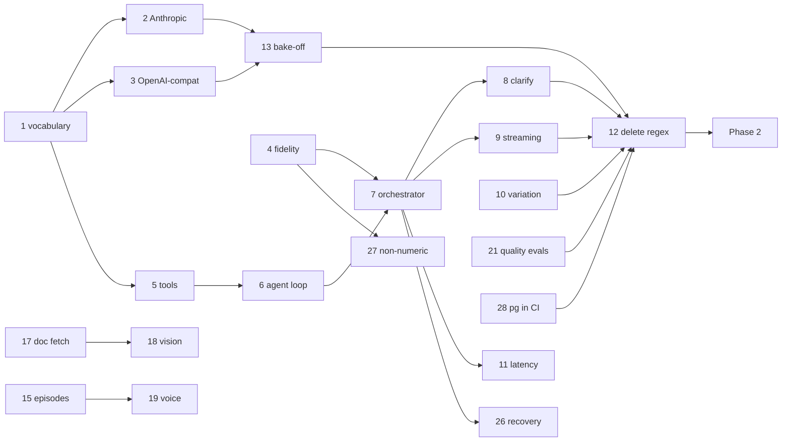

# Conversational Engine Implementation Plan

> **For agentic workers:** REQUIRED SUB-SKILL: Use `superpowers:subagent-driven-development` (recommended) or `superpowers:executing-plans` to implement this plan task-by-task. Steps use checkbox (`- [ ]`) syntax for tracking.

**Goal:** Invert Davi's chat pipeline so the LLM orchestrates the user's own health data through tools instead of sitting downstream of eleven regex gates — without giving up a single safety invariant.

**Architecture:** One internal tool-calling vocabulary with two provider adapters (Anthropic SDK, OpenAI-compatible over httpx). The existing data-ability handlers become tools returning structured data; a bounded agentic loop lets the model call them, ask clarifying questions, and compose an answer. The deterministic triage floor and emergency path stay *before* the model, untouched. The output validator, grounding verifier, and a new numeric-fidelity guard run *after* it, including on streamed output.

**Tech Stack:** Python 3.11 · FastAPI · SQLAlchemy 2 async · `anthropic` SDK · httpx · pytest/aiosqlite · ruff + pyright

**Spec:** [`drawbacks.md`](./drawbacks.md) — the gap analysis this plan implements. [`architecture.md`](./architecture.md) — the as-built system.

---

## Global Constraints

Every task's requirements implicitly include this section.

1. **The triage floor runs before the model, always.** `triage()` → `EMERGENCY` returns `EMERGENCY_DIRECTIVE` or `SELF_HARM_REPLY` deterministically. No tool, no loop, no stream. Never regress `orchestrator.py` step 2.
2. **Triage is a floor, never a ceiling.** Downstream may raise the risk level; nothing may lower it.
3. **`validate_reply()` runs on every user-visible string** — legacy replies, tool-composed answers, streamed sentences, translated output.
4. **Fail open.** Every new layer degrades to `safe_reply(risk)` + a `logger.warning`. A guardrail must never be a new way to break a reply.
5. **No PHI in logs or receipts.** Receipts store `sha256(message)`. Tool arguments and results are never logged verbatim.
6. **Provider identity is never disclosed.** `_PROVIDER_LEAK_RE` stays in the validator and applies to tool-composed output.
7. **Purity is preserved.** `insights/core.py`, `grounding/claims.py`, `chat/memory.py` stay stdlib-only and side-effect free. New pure modules follow the same rule.
8. **Both engines coexist behind `CHAT_ENGINE`** until Task 12. `legacy` must stay green throughout.
9. **`python -m scripts.run_evals` passes on both engines** at the end of every task from Task 7 onward.
10. **Coverage gate `fail_under = 80` holds.** `ruff check . && pyright` clean before every commit.
11. **Model IDs carry no date suffix.** `claude-haiku-4-5`, `claude-sonnet-5`, `claude-opus-5` — never `claude-haiku-4-5-20251001`.
12. **Channel-agnostic.** No task may couple chat logic to HTTP/SSE specifics. WhatsApp is deferred, not excluded — `handle_chat` stays transport-free so a webhook can call it later.
13. **All clinical content remains DRAFT** pending clinician sign-off. No task changes that status.

---

## Scope Decisions (agreed before drafting)

| Decision | Choice | Consequence |
|---|---|---|
| LLM provider | **Undecided — build for both** | Two adapters + a bake-off harness (Task 13) to decide with data |
| Plan depth | **Full arc; Phase 1 in TDD detail** | Tasks 1–13 have literal test code; Tasks 14–25 are task definitions that expand into their own plans |
| Surfaces | **React BFF now; Vision + Voice in scope** | WhatsApp deferred (Constraint 12 keeps the door open) |

---

## File Structure

### Created

| File | Responsibility |
|---|---|
| `app/llm/tools.py` | Internal tool-calling vocabulary — `ToolSpec`, `ToolCall`, `ToolResult`, message types, `LLMTurn`. Pure stdlib. |
| `app/llm/anthropic.py` | Anthropic Messages API adapter (official SDK). Replaces the `AnthropicProvider` half of `providers.py`. |
| `app/llm/openai_compat.py` | OpenAI `/chat/completions` adapter over httpx — covers vLLM, Ollama, llama.cpp, and hosted gateways. |
| `app/grounding/fidelity.py` | Pure numeric-fidelity guards: `digits_preserved`, `unit_values`, `values_traceable`. |
| `app/chat/tools/definitions.py` | JSON Schema `ToolSpec` for each data ability. Pure — no DB. |
| `app/chat/tools/executors.py` | Async executors wrapping the existing handlers, returning structured data. |
| `app/chat/tools/registry.py` | Name → executor map, schema list, SAVEPOINT-isolated dispatch. |
| `app/chat/agent.py` | The bounded agentic loop. |
| `app/chat/streaming.py` | Incremental sentence-level validation for streamed output. |
| `scripts/provider_bakeoff.py` | Runs the eval corpus through candidate providers; emits a comparison table. |

### Modified

| File | Change |
|---|---|
| `app/llm/base.py` | Add `ToolCallingProvider` protocol alongside `LLMProvider`. |
| `app/llm/fake.py` | Scripted `LLMTurn` sequences for deterministic agentic tests. |
| `app/llm/__init__.py` | Provider selection returns the new adapters. |
| `app/llm/providers.py` | **Deleted** — split into `anthropic.py` + `openai_compat.py`. |
| `app/config.py` | `chat_engine`, `llm_max_tool_rounds`, `llm_thinking`, `chat_max_clarifying_questions`, `llm_stream`. |
| `app/chat/orchestrator.py` | Route to the agentic engine behind the flag; keep triage/emergency ahead of it. |
| `app/chat/replies.py` | Canned replies become variant tuples. |
| `app/rag/prompt.py` | Split into a stable cacheable prefix and a volatile suffix. |
| `app/api/v1/chat.py` | Add `POST /api/v1/chat/stream` (SSE). |
| `app/translate/service.py` | Import `digits_preserved` from its new home. |
| `pyproject.toml` | Add `anthropic>=0.40`. |

### Deleted (Task 12, only after tools prove out)

`app/chat/abilities.py` parsers superseded by tools, and their `data_handlers.py` call sites. The handlers' *data access* survives as tool executors; only the natural-language parsing dies.

---

# PHASE 0 — Provider foundation

*No user-visible change. Ends with both adapters able to call tools, proven against mocks.*

---

### Task 1: Internal tool-calling vocabulary

**Files:**
- Create: `app/llm/tools.py`
- Modify: `app/llm/base.py`
- Modify: `app/llm/fake.py`
- Test: `tests/test_llm_tools.py`

**Interfaces:**
- Consumes: nothing (foundation task).
- Produces: `ToolSpec(name, description, input_schema)`, `ToolCall(id, name, arguments)`, `ToolResult(call_id, content, is_error)`, `UserMessage(content)`, `AssistantMessage(content, tool_calls)`, `ToolResultMessage(results)`, `LLMTurn(text, tool_calls, stop_reason, usage)`, and the `ToolCallingProvider` protocol with `async generate_turn(*, system, messages, tools) -> LLMTurn`.

- [ ] **Step 1: Write the failing test**

```python
# tests/test_llm_tools.py
"""The internal tool vocabulary — provider-neutral by construction."""

from __future__ import annotations

import dataclasses

import pytest

from app.llm.fake import FakeProvider
from app.llm.tools import (
    AssistantMessage,
    LLMTurn,
    ToolCall,
    ToolResult,
    ToolResultMessage,
    ToolSpec,
    UserMessage,
)

SPEC = ToolSpec(
    name="get_latest_metric",
    description="Fetch the reader's most recent value for a health metric.",
    input_schema={
        "type": "object",
        "properties": {"metric": {"type": "string"}},
        "required": ["metric"],
        "additionalProperties": False,
    },
)


def test_tool_types_are_frozen():
    with pytest.raises(dataclasses.FrozenInstanceError):
        SPEC.name = "other"  # type: ignore[misc]


def test_tool_result_defaults_to_success():
    result = ToolResult(call_id="c1", content='{"value": 6.1}')
    assert result.is_error is False


def test_tool_result_message_holds_all_results_together():
    """Parallel results must travel in ONE message — splitting them teaches
    the model to stop making parallel calls."""
    msg = ToolResultMessage(
        results=(
            ToolResult(call_id="c1", content="{}"),
            ToolResult(call_id="c2", content="{}"),
        )
    )
    assert len(msg.results) == 2


async def test_fake_provider_scripts_a_tool_call_then_an_answer():
    provider = FakeProvider(
        turns=[
            LLMTurn(
                text="",
                tool_calls=(
                    ToolCall(id="c1", name="get_latest_metric",
                             arguments={"metric": "hba1c"}),
                ),
                stop_reason="tool_use",
            ),
            LLMTurn(text="Your last HbA1c was 6.1%.", stop_reason="end_turn"),
        ]
    )

    first = await provider.generate_turn(
        system="sys", messages=[UserMessage("what was my hba1c")], tools=[SPEC]
    )
    assert first.stop_reason == "tool_use"
    assert first.tool_calls[0].name == "get_latest_metric"
    assert first.tool_calls[0].arguments == {"metric": "hba1c"}

    second = await provider.generate_turn(
        system="sys",
        messages=[
            UserMessage("what was my hba1c"),
            AssistantMessage(content="", tool_calls=first.tool_calls),
            ToolResultMessage(
                results=(ToolResult(call_id="c1", content='{"value": 6.1}'),)
            ),
        ],
        tools=[SPEC],
    )
    assert second.stop_reason == "end_turn"
    assert "6.1" in second.text


async def test_fake_provider_still_supports_plain_generate():
    """The legacy text-only path must keep working — Constraint 8."""
    provider = FakeProvider(responses=["a plain answer"])
    assert await provider.generate(system="s", user="u") == "a plain answer"
```

- [ ] **Step 2: Run test to verify it fails**

Run: `pytest tests/test_llm_tools.py -v`
Expected: FAIL with `ModuleNotFoundError: No module named 'app.llm.tools'`

- [ ] **Step 3: Write the vocabulary**

```python
# app/llm/tools.py
"""Provider-neutral tool-calling vocabulary — pure, stdlib only.

Anthropic and OpenAI-compatible endpoints express tool use with incompatible
wire formats. This module is the single internal shape both adapters translate
to and from, so nothing above the adapter layer knows which provider is live.

Keep this module free of I/O, httpx, and vendor SDK imports.
"""

from __future__ import annotations

from dataclasses import dataclass, field
from typing import Union


@dataclass(frozen=True)
class ToolSpec:
    """A tool offered to the model. ``input_schema`` is JSON Schema."""

    name: str
    description: str
    input_schema: dict


@dataclass(frozen=True)
class ToolCall:
    """The model asking for a tool to run. ``id`` correlates the result."""

    id: str
    name: str
    arguments: dict


@dataclass(frozen=True)
class ToolResult:
    """The outcome of one tool call. ``content`` is a JSON string."""

    call_id: str
    content: str
    is_error: bool = False


@dataclass(frozen=True)
class UserMessage:
    content: str


@dataclass(frozen=True)
class AssistantMessage:
    content: str = ""
    tool_calls: tuple[ToolCall, ...] = ()


@dataclass(frozen=True)
class ToolResultMessage:
    """ALL results from one assistant turn, together.

    Splitting parallel results across several messages silently trains the
    model to stop making parallel calls — holding them in one message makes
    that mistake unrepresentable.
    """

    results: tuple[ToolResult, ...]


Message = Union[UserMessage, AssistantMessage, ToolResultMessage]


@dataclass(frozen=True)
class LLMTurn:
    """One model response.

    stop_reason: "end_turn" | "tool_use" | "max_tokens" | "refusal"
    """

    text: str = ""
    tool_calls: tuple[ToolCall, ...] = ()
    stop_reason: str = "end_turn"
    usage: dict | None = field(default=None)

    @property
    def wants_tools(self) -> bool:
        return self.stop_reason == "tool_use" and bool(self.tool_calls)
```

```python
# app/llm/base.py  — append below the existing LLMProvider
from collections.abc import Sequence
from typing import Protocol, runtime_checkable

from app.llm.tools import LLMTurn, Message, ToolSpec


@runtime_checkable
class ToolCallingProvider(Protocol):
    """A provider that can be offered tools and may ask to call them.

    Implementations translate to and from their vendor wire format and must
    never raise for ordinary completions — callers treat an exception as a
    guardrail failure and degrade to a safe reply.
    """

    model_name: str

    async def generate(self, *, system: str, user: str) -> str: ...

    async def generate_turn(
        self,
        *,
        system: str,
        messages: Sequence[Message],
        tools: Sequence[ToolSpec] = (),
    ) -> LLMTurn: ...
```

- [ ] **Step 4: Extend FakeProvider with scripted turns**

```python
# app/llm/fake.py  — replace the class body, keep the module docstring
from __future__ import annotations

from collections.abc import Sequence

from app.llm.tools import LLMTurn, Message, ToolSpec

_DEFAULT_REPLY = (
    "I can share general health information. For anything specific to you, "
    "please speak with a clinician."
)


class FakeProvider:
    """Deterministic provider for tests and offline dev.

    ``responses`` scripts the legacy text path; ``turns`` scripts the
    tool-calling path. Both fall back to a validator-safe default once the
    script is exhausted, so a test that under-scripts degrades instead of
    raising IndexError.
    """

    model_name = "fake"

    def __init__(
        self,
        responses: Sequence[str] | None = None,
        turns: Sequence[LLMTurn] | None = None,
        raises: BaseException | None = None,
    ) -> None:
        self._responses = list(responses or [])
        self._turns = list(turns or [])
        self._raises = raises
        self.calls: list[dict] = []

    async def generate(self, *, system: str, user: str) -> str:
        if self._raises is not None:
            raise self._raises
        self.calls.append({"system": system, "user": user})
        if self._responses:
            return self._responses.pop(0)
        return _DEFAULT_REPLY

    async def generate_turn(
        self,
        *,
        system: str,
        messages: Sequence[Message],
        tools: Sequence[ToolSpec] = (),
    ) -> LLMTurn:
        if self._raises is not None:
            raise self._raises
        self.calls.append(
            {"system": system, "messages": list(messages),
             "tools": [t.name for t in tools]}
        )
        if self._turns:
            return self._turns.pop(0)
        return LLMTurn(text=_DEFAULT_REPLY, stop_reason="end_turn")
```

- [ ] **Step 5: Run tests to verify they pass**

Run: `pytest tests/test_llm_tools.py -v`
Expected: PASS (5 tests)

- [ ] **Step 6: Verify nothing regressed**

Run: `pytest && ruff check . && pyright`
Expected: full suite green — `FakeProvider(responses=[...])` keyword usage is unchanged.

- [ ] **Step 7: Commit**

```bash
git add app/llm/tools.py app/llm/base.py app/llm/fake.py tests/test_llm_tools.py
git commit -m "feat(llm): provider-neutral tool-calling vocabulary"
```

---

### Task 2: Anthropic adapter

**Files:**
- Create: `app/llm/anthropic.py`
- Modify: `pyproject.toml`, `app/llm/__init__.py`, `railway.toml`
- Test: `tests/test_llm_anthropic.py`

**Interfaces:**
- Consumes: `ToolSpec`, `ToolCall`, `ToolResult`, message types, `LLMTurn` from Task 1.
- Produces: `AnthropicProvider(model, api_key, base_url=None, max_tokens=4096, thinking="off")` implementing `ToolCallingProvider`. Module-level `_to_anthropic_messages(messages) -> list[dict]` and `_from_anthropic_response(resp) -> LLMTurn` are importable for direct unit testing.

**Notes for the implementer:**
- Use the official `anthropic` SDK (`AsyncAnthropic`), not raw httpx. The SDK owns retries, timeouts, and typed errors.
- **Model IDs carry no date suffix.** `railway.toml:44` currently says `claude-haiku-4-5-20251001`; correct it to `claude-haiku-4-5`.
- Thinking is model-gated: `{"type": "adaptive"}` works on 4.6+ models; older models (including Haiku 4.5) reject it. Default `thinking="off"` and send the parameter only when explicitly configured.
- Parallel `tool_result` blocks go in **one** user message — `ToolResultMessage` already guarantees this.

- [ ] **Step 1: Write the failing test**

```python
# tests/test_llm_anthropic.py
"""Anthropic adapter — wire-format translation, tested without a network."""

from __future__ import annotations

import types

import pytest

from app.llm.anthropic import (
    AnthropicProvider,
    _from_anthropic_response,
    _to_anthropic_messages,
    _to_anthropic_tools,
)
from app.llm.tools import (
    AssistantMessage,
    ToolCall,
    ToolResult,
    ToolResultMessage,
    ToolSpec,
    UserMessage,
)

SPEC = ToolSpec(
    name="get_latest_metric",
    description="Fetch a metric.",
    input_schema={"type": "object", "properties": {"metric": {"type": "string"}}},
)


def test_tools_translate_to_input_schema_key():
    out = _to_anthropic_tools([SPEC])
    assert out == [
        {
            "name": "get_latest_metric",
            "description": "Fetch a metric.",
            "input_schema": SPEC.input_schema,
        }
    ]


def test_user_message_translates():
    assert _to_anthropic_messages([UserMessage("hi")]) == [
        {"role": "user", "content": "hi"}
    ]


def test_assistant_tool_call_becomes_tool_use_block():
    msgs = _to_anthropic_messages(
        [AssistantMessage(content="looking", tool_calls=(
            ToolCall(id="c1", name="get_latest_metric", arguments={"metric": "hba1c"}),
        ))]
    )
    assert msgs == [
        {
            "role": "assistant",
            "content": [
                {"type": "text", "text": "looking"},
                {"type": "tool_use", "id": "c1", "name": "get_latest_metric",
                 "input": {"metric": "hba1c"}},
            ],
        }
    ]


def test_all_tool_results_land_in_one_user_message():
    msgs = _to_anthropic_messages(
        [ToolResultMessage(results=(
            ToolResult(call_id="c1", content="{}"),
            ToolResult(call_id="c2", content="{}", is_error=True),
        ))]
    )
    assert len(msgs) == 1
    assert msgs[0]["role"] == "user"
    assert len(msgs[0]["content"]) == 2
    assert msgs[0]["content"][1]["is_error"] is True


def test_response_with_tool_use_parses_to_turn():
    resp = types.SimpleNamespace(
        content=[
            types.SimpleNamespace(type="text", text="one moment"),
            types.SimpleNamespace(type="tool_use", id="c1",
                                  name="get_latest_metric",
                                  input={"metric": "hba1c"}),
        ],
        stop_reason="tool_use",
        usage=types.SimpleNamespace(input_tokens=10, output_tokens=5),
    )
    turn = _from_anthropic_response(resp)
    assert turn.wants_tools
    assert turn.text == "one moment"
    assert turn.tool_calls[0].arguments == {"metric": "hba1c"}
    assert turn.usage == {"input_tokens": 10, "output_tokens": 5}


def test_thinking_omitted_by_default(monkeypatch):
    """Haiku 4.5 rejects `thinking` — never send it unless configured."""
    captured: dict = {}

    class _Messages:
        async def create(self, **kwargs):
            captured.update(kwargs)
            return types.SimpleNamespace(
                content=[types.SimpleNamespace(type="text", text="ok")],
                stop_reason="end_turn",
                usage=types.SimpleNamespace(input_tokens=1, output_tokens=1),
            )

    provider = AnthropicProvider(model="claude-haiku-4-5", api_key="k")
    provider._client = types.SimpleNamespace(messages=_Messages())  # type: ignore[attr-defined]

    import asyncio
    asyncio.get_event_loop().run_until_complete(
        provider.generate_turn(system="s", messages=[UserMessage("hi")])
    )
    assert "thinking" not in captured
    assert captured["model"] == "claude-haiku-4-5"
```

- [ ] **Step 2: Run test to verify it fails**

Run: `pytest tests/test_llm_anthropic.py -v`
Expected: FAIL with `ModuleNotFoundError: No module named 'app.llm.anthropic'`

- [ ] **Step 3: Add the SDK dependency**

```toml
# pyproject.toml — in [project].dependencies
    "anthropic>=0.40",
```

Run: `pip install -e ".[dev]"`

- [ ] **Step 4: Write the adapter**

```python
# app/llm/anthropic.py
"""Anthropic Messages API adapter (official SDK).

Translates the internal tool vocabulary to and from Anthropic's wire format.
The SDK owns retries, timeouts, and typed errors — do not re-implement them.

Model IDs carry NO date suffix: "claude-haiku-4-5", not
"claude-haiku-4-5-20251001".
"""

from __future__ import annotations

import json
import logging
from collections.abc import Sequence

from anthropic import AsyncAnthropic

from app.llm.tools import (
    AssistantMessage,
    LLMTurn,
    Message,
    ToolCall,
    ToolResultMessage,
    ToolSpec,
    UserMessage,
)

logger = logging.getLogger("davi.llm")


def _to_anthropic_tools(tools: Sequence[ToolSpec]) -> list[dict]:
    return [
        {"name": t.name, "description": t.description,
         "input_schema": t.input_schema}
        for t in tools
    ]


def _to_anthropic_messages(messages: Sequence[Message]) -> list[dict]:
    out: list[dict] = []
    for m in messages:
        if isinstance(m, UserMessage):
            out.append({"role": "user", "content": m.content})
        elif isinstance(m, AssistantMessage):
            blocks: list[dict] = []
            if m.content:
                blocks.append({"type": "text", "text": m.content})
            for call in m.tool_calls:
                blocks.append({
                    "type": "tool_use", "id": call.id,
                    "name": call.name, "input": call.arguments,
                })
            out.append({"role": "assistant", "content": blocks})
        elif isinstance(m, ToolResultMessage):
            # One user message carrying EVERY result from that assistant turn.
            out.append({
                "role": "user",
                "content": [
                    {"type": "tool_result", "tool_use_id": r.call_id,
                     "content": r.content, "is_error": r.is_error}
                    for r in m.results
                ],
            })
    return out


def _from_anthropic_response(resp) -> LLMTurn:
    text_parts: list[str] = []
    calls: list[ToolCall] = []
    for block in resp.content:
        if block.type == "text":
            text_parts.append(block.text)
        elif block.type == "tool_use":
            # Inputs may carry provider-specific JSON escaping — never string
            # match on the serialized form.
            args = block.input
            if isinstance(args, str):
                args = json.loads(args)
            calls.append(ToolCall(id=block.id, name=block.name, arguments=args))
    usage = None
    if getattr(resp, "usage", None) is not None:
        usage = {
            "input_tokens": resp.usage.input_tokens,
            "output_tokens": resp.usage.output_tokens,
        }
    return LLMTurn(
        text="".join(text_parts).strip(),
        tool_calls=tuple(calls),
        stop_reason=resp.stop_reason or "end_turn",
        usage=usage,
    )


class AnthropicProvider:
    """Tool-calling provider over the Anthropic Messages API."""

    def __init__(
        self,
        model: str,
        api_key: str,
        base_url: str | None = None,
        max_tokens: int = 4096,
        thinking: str = "off",
    ) -> None:
        self.model = model
        self.model_name = model
        self._max_tokens = max_tokens
        # Model-gated: adaptive thinking is 4.6+ only. Haiku 4.5 returns 400.
        self._thinking = thinking
        kwargs: dict = {"api_key": api_key}
        if base_url:
            kwargs["base_url"] = base_url
        self._client = AsyncAnthropic(**kwargs)

    def _extra(self) -> dict:
        return {"thinking": {"type": "adaptive"}} if self._thinking == "adaptive" else {}

    async def generate(self, *, system: str, user: str) -> str:
        turn = await self.generate_turn(
            system=system, messages=[UserMessage(user)], tools=()
        )
        return turn.text

    async def generate_turn(
        self,
        *,
        system: str,
        messages: Sequence[Message],
        tools: Sequence[ToolSpec] = (),
    ) -> LLMTurn:
        payload: dict = {
            "model": self.model,
            "max_tokens": self._max_tokens,
            "system": system,
            "messages": _to_anthropic_messages(messages),
            **self._extra(),
        }
        if tools:
            payload["tools"] = _to_anthropic_tools(tools)
        resp = await self._client.messages.create(**payload)
        return _from_anthropic_response(resp)
```

- [ ] **Step 5: Fix the date-suffixed model ID**

```bash
sed -i 's/claude-haiku-4-5-20251001/claude-haiku-4-5/' railway.toml
```

- [ ] **Step 6: Run tests to verify they pass**

Run: `pytest tests/test_llm_anthropic.py -v`
Expected: PASS (7 tests)

- [ ] **Step 7: Commit**

```bash
git add pyproject.toml railway.toml app/llm/anthropic.py tests/test_llm_anthropic.py
git commit -m "feat(llm): Anthropic tool-calling adapter on the official SDK"
```

---

### Task 3: OpenAI-compatible adapter

**Files:**
- Create: `app/llm/openai_compat.py`
- Delete: `app/llm/providers.py`
- Modify: `app/llm/__init__.py`, `app/config.py`
- Test: `tests/test_llm_openai_compat.py`

**Interfaces:**
- Consumes: Task 1 vocabulary.
- Produces: `OpenAICompatibleProvider(base_url, model, api_key="", timeout=60.0)` implementing `ToolCallingProvider`; `_to_openai_messages`, `_to_openai_tools`, `_from_openai_response` importable for unit tests. `app.llm.get_provider()` returns an `AnthropicProvider` or `OpenAICompatibleProvider` per `LLM_PROVIDER`.

**Notes:** this adapter is the self-hosting path — vLLM, Ollama, llama.cpp, LM Studio, and every hosted gateway speak this format. Keep the pooled httpx client from the old `providers.py` (keep-alive saves a TLS handshake per turn).

- [ ] **Step 1: Write the failing test**

```python
# tests/test_llm_openai_compat.py
"""OpenAI-compatible adapter — the self-hosting path."""

from __future__ import annotations

import json

from app.llm.openai_compat import (
    _from_openai_response,
    _to_openai_messages,
    _to_openai_tools,
)
from app.llm.tools import (
    AssistantMessage,
    ToolCall,
    ToolResult,
    ToolResultMessage,
    ToolSpec,
    UserMessage,
)

SPEC = ToolSpec(
    name="get_latest_metric",
    description="Fetch a metric.",
    input_schema={"type": "object", "properties": {"metric": {"type": "string"}}},
)


def test_tools_use_the_function_envelope():
    assert _to_openai_tools([SPEC]) == [
        {
            "type": "function",
            "function": {
                "name": "get_latest_metric",
                "description": "Fetch a metric.",
                "parameters": SPEC.input_schema,
            },
        }
    ]


def test_tool_calls_serialize_arguments_as_a_json_string():
    msgs = _to_openai_messages(
        [AssistantMessage(content="", tool_calls=(
            ToolCall(id="c1", name="get_latest_metric", arguments={"metric": "hba1c"}),
        ))]
    )
    assert msgs[0]["tool_calls"][0]["function"]["arguments"] == '{"metric": "hba1c"}'


def test_each_tool_result_becomes_its_own_tool_role_message():
    """OpenAI keys results by tool_call_id in separate messages — the inverse
    of Anthropic's single-message rule."""
    msgs = _to_openai_messages(
        [ToolResultMessage(results=(
            ToolResult(call_id="c1", content="{}"),
            ToolResult(call_id="c2", content="{}"),
        ))]
    )
    assert [m["role"] for m in msgs] == ["tool", "tool"]
    assert msgs[0]["tool_call_id"] == "c1"


def test_response_with_tool_calls_parses_to_turn():
    payload = {
        "choices": [{
            "finish_reason": "tool_calls",
            "message": {
                "content": None,
                "tool_calls": [{
                    "id": "c1", "type": "function",
                    "function": {"name": "get_latest_metric",
                                 "arguments": json.dumps({"metric": "hba1c"})},
                }],
            },
        }],
        "usage": {"prompt_tokens": 10, "completion_tokens": 5},
    }
    turn = _from_openai_response(payload)
    assert turn.wants_tools
    assert turn.tool_calls[0].arguments == {"metric": "hba1c"}


def test_malformed_tool_arguments_do_not_raise():
    """Open-weight models emit invalid JSON more often than hosted ones.
    A bad call must surface as an empty-argument call the executor can
    reject, never as an exception that kills the turn."""
    payload = {
        "choices": [{
            "finish_reason": "tool_calls",
            "message": {"content": None, "tool_calls": [{
                "id": "c1", "type": "function",
                "function": {"name": "get_latest_metric", "arguments": "{not json"},
            }]},
        }],
    }
    turn = _from_openai_response(payload)
    assert turn.tool_calls[0].arguments == {}
```

- [ ] **Step 2: Run test to verify it fails**

Run: `pytest tests/test_llm_openai_compat.py -v`
Expected: FAIL with `ModuleNotFoundError`

- [ ] **Step 3: Write the adapter**

```python
# app/llm/openai_compat.py
"""OpenAI /chat/completions adapter over httpx — the self-hosting path.

Speaks the format used by vLLM, Ollama, llama.cpp, LM Studio, and every
hosted OpenAI-compatible gateway. No vendor SDK, so a self-hosted deployment
needs no extra dependency.

Open-weight models emit malformed tool arguments more often than hosted ones;
parsing is deliberately forgiving so a bad call becomes a rejectable empty
call rather than an exception.
"""

from __future__ import annotations

import json
import logging
from collections.abc import Sequence

import httpx

from app.llm.tools import (
    AssistantMessage,
    LLMTurn,
    Message,
    ToolCall,
    ToolResultMessage,
    ToolSpec,
    UserMessage,
)

logger = logging.getLogger("davi.llm")

_shared_client: httpx.AsyncClient | None = None

_FINISH_MAP = {
    "tool_calls": "tool_use",
    "stop": "end_turn",
    "length": "max_tokens",
    "content_filter": "refusal",
}


def _client(timeout: float) -> httpx.AsyncClient:
    """One pooled client per process — keep-alive skips the TLS handshake."""
    global _shared_client
    if _shared_client is None or _shared_client.is_closed:
        _shared_client = httpx.AsyncClient(
            timeout=timeout,
            limits=httpx.Limits(max_keepalive_connections=5, max_connections=10),
        )
    return _shared_client


def _to_openai_tools(tools: Sequence[ToolSpec]) -> list[dict]:
    return [
        {"type": "function",
         "function": {"name": t.name, "description": t.description,
                      "parameters": t.input_schema}}
        for t in tools
    ]


def _to_openai_messages(messages: Sequence[Message]) -> list[dict]:
    out: list[dict] = []
    for m in messages:
        if isinstance(m, UserMessage):
            out.append({"role": "user", "content": m.content})
        elif isinstance(m, AssistantMessage):
            msg: dict = {"role": "assistant", "content": m.content or None}
            if m.tool_calls:
                msg["tool_calls"] = [
                    {"id": c.id, "type": "function",
                     "function": {"name": c.name,
                                  "arguments": json.dumps(c.arguments)}}
                    for c in m.tool_calls
                ]
            out.append(msg)
        elif isinstance(m, ToolResultMessage):
            # OpenAI keys each result to its call in a separate message.
            out.extend(
                {"role": "tool", "tool_call_id": r.call_id, "content": r.content}
                for r in m.results
            )
    return out


def _from_openai_response(data: dict) -> LLMTurn:
    choice = (data.get("choices") or [{}])[0]
    message = choice.get("message") or {}
    calls: list[ToolCall] = []
    for raw in message.get("tool_calls") or []:
        fn = raw.get("function") or {}
        try:
            args = json.loads(fn.get("arguments") or "{}")
        except (ValueError, TypeError):
            logger.warning("malformed tool arguments from provider; rejecting call")
            args = {}
        calls.append(
            ToolCall(id=raw.get("id", ""), name=fn.get("name", ""),
                     arguments=args if isinstance(args, dict) else {})
        )
    usage_raw = data.get("usage") or {}
    usage = (
        {"input_tokens": usage_raw.get("prompt_tokens", 0),
         "output_tokens": usage_raw.get("completion_tokens", 0)}
        if usage_raw else None
    )
    return LLMTurn(
        text=(message.get("content") or "").strip(),
        tool_calls=tuple(calls),
        stop_reason=_FINISH_MAP.get(choice.get("finish_reason", "stop"), "end_turn"),
        usage=usage,
    )


class OpenAICompatibleProvider:
    def __init__(self, base_url: str, model: str, api_key: str = "",
                 timeout: float = 60.0) -> None:
        self.base_url = base_url.rstrip("/")
        self.model = model
        self.model_name = model
        self._api_key = api_key
        self._timeout = timeout

    def _headers(self) -> dict[str, str]:
        headers = {"Content-Type": "application/json"}
        if self._api_key:
            headers["Authorization"] = f"Bearer {self._api_key}"
        return headers

    async def generate(self, *, system: str, user: str) -> str:
        turn = await self.generate_turn(
            system=system, messages=[UserMessage(user)], tools=()
        )
        return turn.text

    async def generate_turn(
        self,
        *,
        system: str,
        messages: Sequence[Message],
        tools: Sequence[ToolSpec] = (),
    ) -> LLMTurn:
        payload: dict = {
            "model": self.model,
            "messages": [{"role": "system", "content": system},
                         *_to_openai_messages(messages)],
            "temperature": 0,
            "stream": False,
        }
        if tools:
            payload["tools"] = _to_openai_tools(tools)
        resp = await _client(self._timeout).post(
            f"{self.base_url}/chat/completions",
            json=payload, headers=self._headers(), timeout=self._timeout,
        )
        resp.raise_for_status()
        return _from_openai_response(resp.json())
```

- [ ] **Step 4: Rewire provider selection and delete the old module**

```python
# app/llm/__init__.py
"""LLM provider abstraction — model- and cloud-agnostic.

LLM_PROVIDER: fake | anthropic | openai_compatible | ollama (alias).
Tests use FakeProvider and never need a network.
"""

from __future__ import annotations

from app.config import get_settings
from app.llm.base import LLMProvider, ToolCallingProvider
from app.llm.fake import FakeProvider


def get_provider() -> ToolCallingProvider:
    settings = get_settings()
    kind = settings.llm_provider

    if kind == "anthropic":
        from app.llm.anthropic import AnthropicProvider

        return AnthropicProvider(
            model=settings.llm_model,
            api_key=settings.llm_api_key,
            base_url=settings.llm_base_url or None,
            thinking=settings.llm_thinking,
        )
    if kind in ("openai_compatible", "openai"):
        from app.llm.openai_compat import OpenAICompatibleProvider

        return OpenAICompatibleProvider(
            base_url=settings.llm_base_url,
            model=settings.llm_model,
            api_key=settings.llm_api_key,
        )
    if kind == "ollama":
        from app.llm.openai_compat import OpenAICompatibleProvider

        return OpenAICompatibleProvider(
            base_url=settings.ollama_base_url, model=settings.ollama_model
        )
    return FakeProvider()


__all__ = ["LLMProvider", "ToolCallingProvider", "FakeProvider", "get_provider"]
```

```python
# app/config.py — add to Settings
    # Thinking is model-gated: "adaptive" requires a 4.6+ Anthropic model;
    # Haiku 4.5 and every OpenAI-compatible endpoint reject it. Leave "off"
    # unless the configured model is known to support it.
    llm_thinking: str = "off"
```

```bash
git rm app/llm/providers.py
```

- [ ] **Step 5: Run the full suite**

Run: `pytest -v && ruff check . && pyright`
Expected: PASS. `tests/test_chat_abilities.py::test_provider_selection` may need its import path updated from `app.llm.providers` to `app.llm.anthropic` — update it, don't weaken the assertion.

- [ ] **Step 6: Commit**

```bash
git add -A app/llm app/config.py tests/
git commit -m "feat(llm): OpenAI-compatible tool-calling adapter; split providers module"
```

---

# PHASE 1 — The conversational engine

*Ends with the LLM orchestrating the user's data through tools, streaming, and asking questions — with every safety invariant intact.*

---

### Task 4: Numeric fidelity guard

**Files:**
- Create: `app/grounding/fidelity.py`
- Modify: `app/translate/service.py` (import moves)
- Test: `tests/test_fidelity.py`

**Interfaces:**
- Consumes: nothing (pure module).
- Produces: `digits_preserved(source, translated) -> bool` (moved verbatim from `translate/service.py`), `unit_values(text) -> Counter[str]`, `values_traceable(reply, sources) -> tuple[bool, list[str]]`.

**Why this exists.** Once tools return raw data and the *model* composes the sentence, nothing stops it paraphrasing "6.1%" into "around 6.5%". The existing translation layer already solved the identical problem with a digit-fidelity check — this generalises that guard and points it at the model instead of the translator. Only **unit-bearing** values are checked, so ordinary prose numbers ("three things to discuss") never false-positive.

- [ ] **Step 1: Write the failing test**

```python
# tests/test_fidelity.py
"""Numeric fidelity — the model may not invent or drift a clinical value."""

from __future__ import annotations

from app.grounding.fidelity import digits_preserved, unit_values, values_traceable


def test_digits_preserved_moved_intact():
    assert digits_preserved("call 14416 now", "14416 पर कॉल करें")
    assert not digits_preserved("call 14416", "call 1416")


def test_unit_values_extracts_only_unit_bearing_numbers():
    text = "Your HbA1c was 6.1% and BP 128/84 mmHg. Here are 3 things to discuss."
    found = unit_values(text)
    assert "6.1%" in found
    assert "128/84 mmhg" in found
    assert "3" not in found  # a plain prose number is not a clinical value


def test_traceable_when_every_value_appears_in_a_source():
    ok, stray = values_traceable(
        "Your last HbA1c was 6.1%.",
        ['{"test": "HbA1c", "value": "6.1%"}'],
    )
    assert ok and stray == []


def test_untraceable_when_the_model_drifts_a_value():
    ok, stray = values_traceable(
        "Your last HbA1c was 6.5%.",
        ['{"test": "HbA1c", "value": "6.1%"}'],
    )
    assert not ok
    assert stray == ["6.5%"]


def test_no_sources_means_nothing_to_check():
    """General education answers cite no data — they are not in scope here."""
    ok, stray = values_traceable("Adults generally need 7-9 hours of sleep.", [])
    assert ok and stray == []
```

- [ ] **Step 2: Run test to verify it fails**

Run: `pytest tests/test_fidelity.py -v`
Expected: FAIL with `ModuleNotFoundError: No module named 'app.grounding.fidelity'`

- [ ] **Step 3: Write the module**

```python
# app/grounding/fidelity.py
"""Numeric fidelity guards — pure, stdlib only.

Two related jobs, one mechanism:

* ``digits_preserved`` — a machine translation must not corrupt a dosage,
  a lab value, or the Tele-MANAS helpline number.
* ``values_traceable`` — when a reply is composed by the model from tool
  results, every clinical value it states must actually appear in one of
  those results. The model may summarise; it may not drift a number.

Only UNIT-BEARING values are checked. Ordinary prose numbers ("three things
to discuss", "step 2") are not clinical claims and are ignored.
"""

from __future__ import annotations

import re
from collections import Counter

_DIGITS_RE = re.compile(r"\d+")

# A blood-pressure pair, or a number immediately followed by a clinical unit.
# Mirrors the unit vocabulary in app/grounding/claims.py.
_UNIT_VALUE_RE = re.compile(
    r"\b\d{2,3}\s*/\s*\d{2,3}\s*mmhg"
    r"|\b\d+(?:\.\d+)?\s?(?:mg/dl|mmhg|mmol/l|mcg|mg|g/dl|g|ml|iu|%|bpm|kg)\b",
    re.IGNORECASE,
)


def digits_preserved(source: str, translated: str) -> bool:
    """True when every digit sequence survived a transformation unchanged."""
    return Counter(_DIGITS_RE.findall(source)) == Counter(
        _DIGITS_RE.findall(translated)
    )


def _normalize(value: str) -> str:
    return re.sub(r"\s+", "", value.strip().lower())


def unit_values(text: str) -> Counter[str]:
    """Normalized unit-bearing values found in the text."""
    return Counter(_normalize(m.group(0)) for m in _UNIT_VALUE_RE.finditer(text))


def values_traceable(reply: str, sources: list[str]) -> tuple[bool, list[str]]:
    """Check every clinical value in ``reply`` against the supplied sources.

    Returns (ok, untraceable_values). With no sources there is nothing to
    check — a general education answer is out of scope for this guard.
    """
    if not sources:
        return True, []
    haystack = _normalize(" ".join(sources))
    stray = [
        value for value in unit_values(reply)
        if _normalize(value) not in haystack
    ]
    # Report in the reply's own casing for a legible log line.
    if stray:
        originals = [
            m.group(0) for m in _UNIT_VALUE_RE.finditer(reply)
            if _normalize(m.group(0)) in stray
        ]
        return False, sorted(set(originals))
    return True, []
```

- [ ] **Step 4: Point the translator at the new home**

```python
# app/translate/service.py
# Replace the local _DIGITS_RE + digits_preserved definition with:
from app.grounding.fidelity import digits_preserved
```

- [ ] **Step 5: Run tests to verify they pass**

Run: `pytest tests/test_fidelity.py tests/test_translate_pivot.py -v`
Expected: PASS — the translation tests must stay green after the move.

- [ ] **Step 6: Commit**

```bash
git add app/grounding/fidelity.py app/translate/service.py tests/test_fidelity.py
git commit -m "feat(grounding): numeric fidelity guard; generalize the digit check"
```

---

### Task 5: Tool definitions and executors

**Files:**
- Create: `app/chat/tools/__init__.py`, `definitions.py`, `executors.py`, `registry.py`
- Test: `tests/test_chat_tools.py`

**Interfaces:**
- Consumes: `ToolSpec`, `ToolCall`, `ToolResult`; the existing handlers in `app/chat/data_handlers.py` and readers in `app/coredata/service.py`.
- Produces: `TOOL_SPECS: tuple[ToolSpec, ...]`, `async execute_tool(db, user_id, call, session_id) -> ToolResult`, and `SOURCE_TEXTS: ContextVar` accumulating raw tool payloads for Task 4's fidelity check.

**Design rule — tools return DATA, replies stay deterministic where they can.** Each executor returns the structured payload the handler computes, plus the handler's own validator-safe `reply` string under a `deterministic_reply` key. The model is instructed to prefer that phrasing verbatim when it fits the question; the fidelity guard catches it if it paraphrases a number wrongly. This keeps the audited wording as the default and lets the model deviate only to *combine* facts — which is the whole point of the refactor.

> **⚠️ Prerequisite the handlers do not currently satisfy.** The handlers today format their values into the reply *string* and discard the structure. `handle_metric_query` returns `provenance: {"path": "metric_query", "metric": "hba1c"}` — no value, no unit, no date (`data_handlers.py:647`). An executor reading `prov.get("value")` gets `None`.
>
> **Step 3 below widens the handlers' provenance first.** This is additive — the legacy engine ignores the extra keys, so `CHAT_ENGINE=legacy` is unaffected and its tests stay green. Do not skip it; every executor depends on it.

**The nine tools** (each maps to a handler whose data access is already written and tested):

| Tool | Wraps | Returns |
|---|---|---|
| `get_documents` | `handle_document_query` | document cards + consent-filtered listing |
| `get_latest_metric` | `handle_metric_query` | value, unit, date, source |
| `get_report_parameter` | `handle_report_param_ask` | test name, value, `abnormal_flag`, date |
| `get_health_summary` | `handle_summary_query` | period totals + chart spec |
| `check_value_against_range` | `handle_value_check` | verdict, range text, severity |
| `log_lifestyle_entry` | `handle_tracker_add` | confirmation of what was recorded |
| `get_family_members` | `handle_family_list_query` | connected members + share status |
| `get_condition_guidance` | `handle_suggestion_query` | MCP profile sections + citations |
| `lookup_medicine` | `drugs.find_drug` | composition, uses, side effects, safety note |

- [ ] **Step 1: Write the failing test**

```python
# tests/test_chat_tools.py
"""Tool executors — structured data out, never an exception."""

from __future__ import annotations

import json
import uuid

from app.chat.tools.definitions import TOOL_SPECS
from app.chat.tools.registry import execute_tool
from app.llm.tools import ToolCall


def test_every_spec_has_a_strict_object_schema():
    """A loose schema is how open-weight models produce garbage arguments."""
    assert TOOL_SPECS
    for spec in TOOL_SPECS:
        assert spec.input_schema["type"] == "object"
        assert spec.input_schema.get("additionalProperties") is False
        assert spec.description.strip()


def test_every_spec_has_a_registered_executor():
    from app.chat.tools.registry import EXECUTORS

    assert {s.name for s in TOOL_SPECS} == set(EXECUTORS)


async def test_unknown_tool_returns_an_error_result_not_an_exception(db_session):
    result = await execute_tool(
        db_session, uuid.uuid4(),
        ToolCall(id="c1", name="no_such_tool", arguments={}), None,
    )
    assert result.is_error
    assert result.call_id == "c1"


async def test_executor_failure_is_isolated_and_reported(db_session, monkeypatch):
    """A handler crash must roll back only its own writes and leave the
    session usable — the loop continues with an error result."""
    from app.chat.tools import executors

    async def _boom(*_a, **_kw):
        raise RuntimeError("table missing")

    monkeypatch.setattr(executors, "handle_metric_query", _boom)

    result = await execute_tool(
        db_session, uuid.uuid4(),
        ToolCall(id="c1", name="get_latest_metric", arguments={"metric": "hba1c"}),
        None,
    )
    assert result.is_error
    assert "could not" in json.loads(result.content)["error"].lower()

    # The session survives — a following query still works.
    from sqlalchemy import text
    assert (await db_session.execute(text("SELECT 1"))).scalar() == 1


async def test_metric_tool_returns_data_and_the_deterministic_reply(
    db_session, seeded_user_with_hba1c
):
    result = await execute_tool(
        db_session, seeded_user_with_hba1c,
        ToolCall(id="c1", name="get_latest_metric", arguments={"metric": "hba1c"}),
        None,
    )
    payload = json.loads(result.content)
    assert not result.is_error
    assert payload["value"] == 6.1
    assert payload["unit"] == "%"
    assert "deterministic_reply" in payload
```

- [ ] **Step 2: Run test to verify it fails**

Run: `pytest tests/test_chat_tools.py -v`
Expected: FAIL with `ModuleNotFoundError: No module named 'app.chat.tools'`

- [ ] **Step 3: Widen the handlers' provenance (prerequisite)**

Each handler keeps its reply byte-identical and gains structured keys in `provenance`. Purely additive — legacy reads none of them.

```python
# app/chat/data_handlers.py — in handle_metric_query, replace the return block

    return {
        "reply": (
            f"Your most recent {display} on record is {value_text} "
            f"(recorded {when}). {_NOT_MEDICAL_ADVICE}"
        ),
        "action": "review_with_clinician",
        "provenance": {
            "path": "metric_query",
            "metric": query.metric,
            # Structured values for the tool executors. The legacy engine
            # ignores these; the agentic engine answers from them, and the
            # fidelity guard checks the model's wording against them.
            "value": value,
            "unit": found_unit or unit,
            "value_text": value_text,
            "recorded_at": when,
            "source": spec["source"],
        },
        "visual": visual,
    }
```

Hoist `value` out of each branch so it is bound on every path (the vital and body branches currently only build `value_text`). Apply the same treatment to:

| Handler | Add to `provenance` |
|---|---|
| `handle_report_param_ask` | `parameter`, `value`, `unit`, `abnormal_flag`, `recorded_at` |
| `handle_value_check` | `metric`, `value`, `secondary`, `status`, `range_text`, `severity` |
| `handle_tracker_add` | `kind`, `quantity`, `unit`, `logged_for` |
| `handle_summary_query` | `period`, `totals` |
| `handle_family_list_query` | `members` (name, relation, shares_files) |
| `handle_suggestion_query` | `condition_codes`, `sections` |

`handle_document_query` already carries `documents` in provenance — leave it.

Run: `pytest tests/test_app_data_lookups.py tests/test_chat_abilities.py -v`
Expected: PASS unchanged — replies are byte-identical, so no legacy assertion moves.

- [ ] **Step 4: Write the definitions**

```python
# app/chat/tools/definitions.py
"""JSON Schema tool specs for the data abilities. Pure — no DB, no I/O.

Every schema sets additionalProperties=False and lists required fields: a
loose schema is how an open-weight model produces arguments the executor
cannot use.
"""

from __future__ import annotations

from app.llm.tools import ToolSpec


def _obj(properties: dict, required: list[str]) -> dict:
    return {
        "type": "object",
        "properties": properties,
        "required": required,
        "additionalProperties": False,
    }


GET_LATEST_METRIC = ToolSpec(
    name="get_latest_metric",
    description=(
        "Get the reader's most recent recorded value for a health metric "
        "(blood pressure, blood sugar, HbA1c, weight, heart rate, SpO2). "
        "Use when they ask what their latest reading was."
    ),
    input_schema=_obj(
        {"metric": {"type": "string",
                    "description": "Metric key, e.g. 'hba1c', 'blood_pressure'."}},
        ["metric"],
    ),
)

GET_REPORT_PARAMETER = ToolSpec(
    name="get_report_parameter",
    description=(
        "Look up any parameter extracted from the reader's lab reports "
        "(creatinine, basophils, RDW, …). Returns the value, the report's "
        "abnormal flag, and the date. Only answers when the test is on file."
    ),
    input_schema=_obj(
        {"parameter": {"type": "string"}}, ["parameter"],
    ),
)

GET_DOCUMENTS = ToolSpec(
    name="get_documents",
    description=(
        "List the reader's stored documents, or a connected family member's "
        "documents when they name one. Family access already honours accepted "
        "connections, the owner's file-share grant, privacy flags, and "
        "per-file exclusions — never bypass it."
    ),
    input_schema=_obj(
        {
            "kinds": {"type": "array", "items": {"type": "string"},
                      "description": "e.g. ['report','scan','prescription']"},
            "relation": {"type": "string",
                         "description": "e.g. 'father'. Omit for the reader."},
            "owner_name": {"type": "string",
                           "description": "A connected member's name."},
        },
        [],
    ),
)

CHECK_VALUE_AGAINST_RANGE = ToolSpec(
    name="check_value_against_range",
    description=(
        "Compare a reading the reader states to its reference range. Returns "
        "in-range / above / below with the typical range. Never returns a "
        "diagnosis."
    ),
    input_schema=_obj(
        {
            "metric": {"type": "string"},
            "value": {"type": "number"},
            "secondary": {"type": "number",
                          "description": "Diastolic, for blood pressure."},
        },
        ["metric", "value"],
    ),
)

LOG_LIFESTYLE_ENTRY = ToolSpec(
    name="log_lifestyle_entry",
    description=(
        "Record a lifestyle entry the reader reports (water, coffee, tea, "
        "alcohol, smoking), optionally backdated. Confirm what was recorded."
    ),
    input_schema=_obj(
        {
            "kind": {"type": "string"},
            "quantity": {"type": "number"},
            "days_ago": {"type": "integer", "minimum": 0, "maximum": 30},
        },
        ["kind", "quantity"],
    ),
)

GET_HEALTH_SUMMARY = ToolSpec(
    name="get_health_summary",
    description="Summarise the reader's recorded data over a week, month, or year.",
    input_schema=_obj(
        {"period": {"type": "string", "enum": ["week", "month", "year"]}},
        ["period"],
    ),
)

GET_FAMILY_MEMBERS = ToolSpec(
    name="get_family_members",
    description="List the reader's connected family members and what each shares.",
    input_schema=_obj({}, []),
)

GET_CONDITION_GUIDANCE = ToolSpec(
    name="get_condition_guidance",
    description=(
        "Fetch clinically reviewed guidance for a condition from the validated "
        "Master Condition Profiles. Returns sections with citations. Prefer "
        "this over answering from general knowledge."
    ),
    input_schema=_obj({"condition": {"type": "string"}}, ["condition"]),
)

LOOKUP_MEDICINE = ToolSpec(
    name="lookup_medicine",
    description=(
        "Look up a medicine in the validated medicines database — composition, "
        "uses, reported side effects, substitutes. No interaction data exists: "
        "route combination questions to a pharmacist instead."
    ),
    input_schema=_obj({"name": {"type": "string"}}, ["name"]),
)

TOOL_SPECS: tuple[ToolSpec, ...] = (
    GET_LATEST_METRIC,
    GET_REPORT_PARAMETER,
    GET_DOCUMENTS,
    CHECK_VALUE_AGAINST_RANGE,
    LOG_LIFESTYLE_ENTRY,
    GET_HEALTH_SUMMARY,
    GET_FAMILY_MEMBERS,
    GET_CONDITION_GUIDANCE,
    LOOKUP_MEDICINE,
)
```

- [ ] **Step 5: Write the registry and executors**

```python
# app/chat/tools/registry.py
"""Tool dispatch — SAVEPOINT-isolated, fail-closed to an error result.

A tool must NEVER raise into the agent loop: the model needs to see that a
call failed so it can recover, and a handler crash must roll back only its
own writes (a missing core table in a standalone deployment must not poison
the session).
"""

from __future__ import annotations

import json
import logging
import uuid

from sqlalchemy.ext.asyncio import AsyncSession

from app.chat.tools import executors
from app.chat.tools.definitions import TOOL_SPECS
from app.llm.tools import ToolCall, ToolResult

logger = logging.getLogger("davi.tools")

EXECUTORS = {
    "get_latest_metric": executors.get_latest_metric,
    "get_report_parameter": executors.get_report_parameter,
    "get_documents": executors.get_documents,
    "check_value_against_range": executors.check_value_against_range,
    "log_lifestyle_entry": executors.log_lifestyle_entry,
    "get_health_summary": executors.get_health_summary,
    "get_family_members": executors.get_family_members,
    "get_condition_guidance": executors.get_condition_guidance,
    "lookup_medicine": executors.lookup_medicine,
}

__all__ = ["EXECUTORS", "TOOL_SPECS", "execute_tool"]


def _error(call_id: str, message: str) -> ToolResult:
    return ToolResult(
        call_id=call_id, content=json.dumps({"error": message}), is_error=True
    )


async def execute_tool(
    db: AsyncSession,
    user_id: uuid.UUID,
    call: ToolCall,
    session_id: uuid.UUID | None,
) -> ToolResult:
    """Run one tool call. Always returns a ToolResult — never raises."""
    fn = EXECUTORS.get(call.name)
    if fn is None:
        logger.warning("model requested unknown tool %r", call.name)
        return _error(call.id, f"No tool named {call.name!r} is available.")
    if not isinstance(call.arguments, dict):
        return _error(call.id, "Tool arguments could not be read.")
    try:
        async with db.begin_nested():
            payload = await fn(db, user_id, call.arguments, session_id)
    except Exception:  # noqa: BLE001 — a tool must never break the loop
        logger.warning("tool %s failed", call.name, exc_info=True)
        return _error(call.id, "That lookup could not be completed.")
    if payload is None:
        return ToolResult(
            call_id=call.id,
            content=json.dumps({"found": False}),
        )
    return ToolResult(call_id=call.id, content=json.dumps(payload, default=str))
```

```python
# app/chat/tools/executors.py
"""Executors wrapping the existing handlers, returning structured data.

Each returns a JSON-serialisable dict (or None for "nothing found") carrying
BOTH the structured facts and the handler's own validator-safe wording under
``deterministic_reply``. The model is told to prefer that wording verbatim
when it answers the question directly, and to compose only when it needs to
combine facts the handler could not.

No exception handling here — app/chat/tools/registry.py owns the SAVEPOINT
and the fail-closed contract.
"""

from __future__ import annotations

import uuid

from sqlalchemy.ext.asyncio import AsyncSession

from app.chat.data_handlers import (
    handle_document_query,
    handle_family_list_query,
    handle_metric_query,
    handle_report_param_ask,
    handle_summary_query,
    handle_suggestion_query,
    handle_tracker_add,
    handle_value_check,
)
from app.chat.context import build_patient_context
from app.drugs.service import build_drug_reply, find_drug


def _unwrap(ability: dict | None, **extra) -> dict | None:
    """Handler dict → tool payload."""
    if ability is None:
        return None
    payload = {
        "deterministic_reply": ability["reply"],
        "provenance": ability.get("provenance", {}),
        **extra,
    }
    for key in ("documents", "visual", "citations"):
        if ability.get(key):
            payload[key] = ability[key]
    return payload


async def get_latest_metric(
    db: AsyncSession, user_id: uuid.UUID, args: dict, _sid
) -> dict | None:
    metric = str(args.get("metric", ""))
    ability = await handle_metric_query(db, user_id, f"what is my latest {metric}")
    if ability is None:
        return None
    prov = ability.get("provenance", {})
    return _unwrap(
        ability,
        metric=prov.get("metric", metric),
        value=prov.get("value"),
        unit=prov.get("unit"),
        recorded_at=prov.get("recorded_at"),
        source=prov.get("source"),
    )


async def get_report_parameter(
    db: AsyncSession, user_id: uuid.UUID, args: dict, _sid
) -> dict | None:
    param = str(args.get("parameter", ""))
    ability = await handle_report_param_ask(db, user_id, f"what is my {param}")
    return _unwrap(ability, parameter=param)


async def get_documents(
    db: AsyncSession, user_id: uuid.UUID, args: dict, _sid
) -> dict | None:
    kinds = args.get("kinds") or ["document"]
    who = args.get("relation") or args.get("owner_name") or ""
    phrase = f"show me {who + ' ' if who else ''}{' '.join(kinds)}"
    ability = await handle_document_query(db, user_id, phrase)
    return _unwrap(ability)


async def check_value_against_range(
    db: AsyncSession, user_id: uuid.UUID, args: dict, sid
) -> dict | None:
    metric, value = str(args.get("metric", "")), args.get("value")
    secondary = args.get("secondary")
    reading = f"{value}/{secondary}" if secondary is not None else f"{value}"
    ability = await handle_value_check(db, user_id, f"my {metric} is {reading}", sid)
    return _unwrap(ability, metric=metric, value=value, secondary=secondary)


async def log_lifestyle_entry(
    db: AsyncSession, user_id: uuid.UUID, args: dict, _sid
) -> dict | None:
    kind, qty = str(args.get("kind", "")), args.get("quantity")
    days = int(args.get("days_ago") or 0)
    when = "today" if days == 0 else ("yesterday" if days == 1 else f"{days} days ago")
    ability = await handle_tracker_add(db, user_id, f"I had {qty} {kind} {when}")
    return _unwrap(ability, kind=kind, quantity=qty, days_ago=days)


async def get_health_summary(
    db: AsyncSession, user_id: uuid.UUID, args: dict, _sid
) -> dict | None:
    period = str(args.get("period", "week"))
    ability = await handle_summary_query(db, user_id, f"health summary for the {period}")
    return _unwrap(ability, period=period)


async def get_family_members(
    db: AsyncSession, user_id: uuid.UUID, _args: dict, _sid
) -> dict | None:
    ability = await handle_family_list_query(db, user_id, "who is in my family")
    return _unwrap(ability)


async def get_condition_guidance(
    db: AsyncSession, user_id: uuid.UUID, args: dict, _sid
) -> dict | None:
    condition = str(args.get("condition", ""))
    _text, codes = await build_patient_context(db, user_id)
    ability = await handle_suggestion_query(
        db, user_id, f"tips for {condition}", codes
    )
    return _unwrap(ability, condition=condition)


async def lookup_medicine(
    db: AsyncSession, _user_id: uuid.UUID, args: dict, _sid
) -> dict | None:
    drug = await find_drug(db, str(args.get("name", "")))
    if drug is None:
        return None
    return {
        "deterministic_reply": build_drug_reply(drug),
        "name": drug.name,
        "composition": [c for c in (drug.composition1, drug.composition2) if c],
        "uses": (drug.uses or [])[:5],
        "side_effects": (drug.side_effects or [])[:5],
        "habit_forming": drug.habit_forming,
        "has_interaction_data": False,
    }
```

- [ ] **Step 6: Add the test fixture**

```python
# tests/conftest.py — append
@pytest_asyncio.fixture
async def seeded_user_with_hba1c(db_session):
    """A user with one lab report carrying an HbA1c of 6.1%."""
    import uuid as _uuid

    from app.models.coredata import Report

    user_id = _uuid.uuid4()
    db_session.add(
        Report(
            id=1, user_id=user_id, filepath="reports/abc", private=False,
            content={"ai": {"extraction": {"results": [
                {"test_name": "HbA1c", "value": "6.1", "unit": "%",
                 "value_numeric": 6.1, "abnormal_flag": "high"}
            ]}}},
        )
    )
    await db_session.flush()
    return user_id
```

- [ ] **Step 7: Run tests to verify they pass**

Run: `pytest tests/test_chat_tools.py -v`
Expected: PASS (5 tests)

- [ ] **Step 8: Commit**

```bash
git add app/chat/tools app/chat/data_handlers.py tests/test_chat_tools.py tests/conftest.py
git commit -m "feat(chat): expose the data abilities as tools returning structured data"
```

---

### Task 6: The bounded agentic loop

**Files:**
- Create: `app/chat/agent.py`
- Modify: `app/config.py`
- Test: `tests/test_agent_loop.py`

**Interfaces:**
- Consumes: `ToolCallingProvider`, `TOOL_SPECS`, `execute_tool`.
- Produces: `AgentOutcome(text, rounds, tool_names, source_texts, usage)` and `async run_agent(provider, system, messages, tools, executor, max_rounds) -> AgentOutcome`.

**Design rules.**
- Parallel calls in one turn execute concurrently via `asyncio.gather`; all results return in one `ToolResultMessage`.
- After `max_rounds`, one final call is made **with no tools offered**, forcing a text answer instead of an infinite tool loop.
- `source_texts` accumulates every tool result payload — Task 7 feeds it to `values_traceable`.

- [ ] **Step 1: Write the failing test**

```python
# tests/test_agent_loop.py
"""The agent loop — bounded, parallel, and always terminating in text."""

from __future__ import annotations

from app.chat.agent import run_agent
from app.llm.fake import FakeProvider
from app.llm.tools import LLMTurn, ToolCall, ToolResult, ToolSpec, UserMessage

SPEC = ToolSpec(name="t", description="d",
                input_schema={"type": "object", "properties": {},
                              "additionalProperties": False})


async def _echo(call: ToolCall) -> ToolResult:
    return ToolResult(call_id=call.id, content='{"value": 6.1}')


async def test_a_plain_answer_uses_no_rounds():
    provider = FakeProvider(turns=[LLMTurn(text="hello", stop_reason="end_turn")])
    out = await run_agent(provider, "sys", [UserMessage("hi")], [SPEC], _echo)
    assert out.text == "hello"
    assert out.rounds == 0
    assert out.tool_names == []


async def test_one_tool_round_then_an_answer():
    provider = FakeProvider(turns=[
        LLMTurn(tool_calls=(ToolCall("c1", "t", {}),), stop_reason="tool_use"),
        LLMTurn(text="Your HbA1c was 6.1%.", stop_reason="end_turn"),
    ])
    out = await run_agent(provider, "sys", [UserMessage("hba1c?")], [SPEC], _echo)
    assert out.rounds == 1
    assert out.tool_names == ["t"]
    assert '{"value": 6.1}' in out.source_texts[0]


async def test_parallel_calls_run_together_and_return_in_one_message():
    provider = FakeProvider(turns=[
        LLMTurn(tool_calls=(ToolCall("c1", "t", {}), ToolCall("c2", "t", {})),
                stop_reason="tool_use"),
        LLMTurn(text="both done", stop_reason="end_turn"),
    ])
    out = await run_agent(provider, "sys", [UserMessage("x")], [SPEC], _echo)
    assert out.rounds == 1
    assert len(out.source_texts) == 2


async def test_budget_exhaustion_forces_a_final_text_answer():
    """A model that keeps asking for tools must still produce text."""
    looping = [
        LLMTurn(tool_calls=(ToolCall(f"c{i}", "t", {}),), stop_reason="tool_use")
        for i in range(5)
    ]
    provider = FakeProvider(turns=[*looping,
                                   LLMTurn(text="final", stop_reason="end_turn")])
    out = await run_agent(provider, "sys", [UserMessage("x")], [SPEC], _echo,
                          max_rounds=2)
    assert out.rounds == 2
    assert out.text == "final"
    # The forced final call offers NO tools.
    assert provider.calls[-1]["tools"] == []


async def test_a_failing_tool_does_not_stop_the_loop():
    async def _broken(call):
        return ToolResult(call_id=call.id, content='{"error": "nope"}', is_error=True)

    provider = FakeProvider(turns=[
        LLMTurn(tool_calls=(ToolCall("c1", "t", {}),), stop_reason="tool_use"),
        LLMTurn(text="I could not look that up.", stop_reason="end_turn"),
    ])
    out = await run_agent(provider, "sys", [UserMessage("x")], [SPEC], _broken)
    assert out.text == "I could not look that up."
```

- [ ] **Step 2: Run test to verify it fails**

Run: `pytest tests/test_agent_loop.py -v`
Expected: FAIL with `ModuleNotFoundError: No module named 'app.chat.agent'`

- [ ] **Step 3: Write the loop**

```python
# app/chat/agent.py
"""The bounded agentic loop.

The model may call tools, read their results, and call more — up to
``max_rounds``. After that one final call is made with NO tools offered,
which forces a text answer instead of an unbounded loop.

This module owns control flow only. Safety (triage, validation, grounding,
fidelity) lives in the orchestrator, before and after this runs.
"""

from __future__ import annotations

import asyncio
import logging
from collections.abc import Awaitable, Callable, Sequence
from dataclasses import dataclass, field

from app.llm.tools import (
    AssistantMessage,
    LLMTurn,
    Message,
    ToolCall,
    ToolResult,
    ToolResultMessage,
    ToolSpec,
)

logger = logging.getLogger("davi.agent")

DEFAULT_MAX_ROUNDS = 3

_FORCE_ANSWER = (
    "\n\nYou have used your tool budget for this turn. Answer now in plain "
    "language using what you already have. If something is still missing, say "
    "so plainly and suggest what the reader can check with their clinician."
)

Executor = Callable[[ToolCall], Awaitable[ToolResult]]


@dataclass
class AgentOutcome:
    text: str
    rounds: int = 0
    tool_names: list[str] = field(default_factory=list)
    # Raw tool payloads — the fidelity guard checks stated values against these.
    source_texts: list[str] = field(default_factory=list)
    usage: dict = field(default_factory=dict)
    messages: list[Message] = field(default_factory=list)


def _accumulate_usage(total: dict, turn: LLMTurn) -> None:
    if not turn.usage:
        return
    for key, value in turn.usage.items():
        total[key] = total.get(key, 0) + value
    total["calls"] = total.get("calls", 0) + 1


async def run_agent(
    provider,
    system: str,
    messages: Sequence[Message],
    tools: Sequence[ToolSpec],
    executor: Executor,
    max_rounds: int = DEFAULT_MAX_ROUNDS,
) -> AgentOutcome:
    """Drive the tool loop to a text answer."""
    history: list[Message] = list(messages)
    outcome = AgentOutcome(text="")

    for round_index in range(max_rounds):
        turn = await provider.generate_turn(
            system=system, messages=history, tools=tools
        )
        _accumulate_usage(outcome.usage, turn)

        if not turn.wants_tools:
            outcome.text = turn.text
            outcome.rounds = round_index
            outcome.messages = history
            return outcome

        history.append(AssistantMessage(content=turn.text,
                                        tool_calls=turn.tool_calls))
        results = await asyncio.gather(
            *(executor(call) for call in turn.tool_calls)
        )
        history.append(ToolResultMessage(results=tuple(results)))
        outcome.tool_names.extend(c.name for c in turn.tool_calls)
        outcome.source_texts.extend(r.content for r in results)

    # Budget exhausted — force text by offering no tools.
    logger.info("agent tool budget exhausted after %d rounds", max_rounds)
    final = await provider.generate_turn(
        system=system + _FORCE_ANSWER, messages=history, tools=()
    )
    _accumulate_usage(outcome.usage, final)
    outcome.text = final.text
    outcome.rounds = max_rounds
    outcome.messages = history
    return outcome
```

```python
# app/config.py — add to Settings
    # Chat engine: "legacy" (deterministic handler chain) | "agentic" (tools).
    chat_engine: str = "legacy"
    llm_max_tool_rounds: int = 3
```

**Also in Task 7 — close drawback 5.7.** `grounding_mode` defaults to `"log"` in code while `.env.example` says `enforce`; the code default wins when the var is unset, so an unconfigured deployment ships ungrounded clinical claims and merely logs them. Change the default:

```python
# app/config.py — grounding_mode
    # Was "log": an unset env var meant violations shipped to the user with
    # only a WARNING. "enforce" is the safe default; "log" stays available
    # for local debugging.
    grounding_mode: str = "enforce"
```

Run `pytest tests/test_grounding.py tests/test_grounding_orchestrator_edge.py -v` — tests that assumed the `log` default must now set it explicitly rather than rely on it.

- [ ] **Step 4: Run tests to verify they pass**

Run: `pytest tests/test_agent_loop.py -v`
Expected: PASS (5 tests)

- [ ] **Step 5: Commit**

```bash
git add app/chat/agent.py app/config.py tests/test_agent_loop.py
git commit -m "feat(chat): bounded agentic loop with parallel tool execution"
```

---

### Task 7: Wire the agentic engine into the orchestrator

**Files:**
- Modify: `app/chat/orchestrator.py`, `app/rag/prompt.py`
- Test: `tests/test_agentic_orchestrator.py`

**Interfaces:**
- Consumes: `run_agent`, `TOOL_SPECS`, `execute_tool`, `values_traceable`, `validate_reply`.
- Produces: `_dispatch_agentic(db, user_id, message, provider, session_id, pivot) -> ChatResult`, selected inside `_dispatch` when `settings.chat_engine == "agentic"`.

**This is the load-bearing task.** Order that must not change:

```
triage floor  →  scope guard  →  EMERGENCY (deterministic, no model)
              →  conversational (greeting/identity, no model)
              →  [ AGENTIC LOOP with tools ]           ← replaces steps 4–6
              →  grounding  →  validate_reply  →  values_traceable
              →  receipt  →  outbound translate
```

Steps 1–3 are **copied unchanged** from the legacy path. Only the section below `risk == NONE` is replaced.

- [ ] **Step 1: Write the failing test**

```python
# tests/test_agentic_orchestrator.py
"""The agentic engine must keep every safety invariant the legacy one has."""

from __future__ import annotations

import uuid

import pytest

from app.chat.orchestrator import handle_chat
from app.llm.fake import FakeProvider
from app.llm.tools import LLMTurn, ToolCall


@pytest.fixture(autouse=True)
def _agentic(monkeypatch):
    from app.config import get_settings

    monkeypatch.setenv("CHAT_ENGINE", "agentic")
    get_settings.cache_clear()
    yield
    get_settings.cache_clear()


async def test_emergency_never_reaches_the_model(db_session):
    provider = FakeProvider(turns=[LLMTurn(text="should never be used")])
    result = await handle_chat(db_session, uuid.uuid4(), "I can't breathe", provider)
    assert result.risk_level == "emergency"
    assert result.recommended_action == "call_emergency_services"
    assert provider.calls == []


async def test_self_harm_still_returns_the_helpline_verbatim(db_session):
    provider = FakeProvider(turns=[LLMTurn(text="ignored")])
    result = await handle_chat(
        db_session, uuid.uuid4(), "I want to hurt myself", provider
    )
    assert "14416" in result.response_message
    assert provider.calls == []


async def test_the_model_can_reach_the_readers_own_data(
    db_session, seeded_user_with_hba1c
):
    """The composite question the legacy engine structurally cannot answer."""
    provider = FakeProvider(turns=[
        LLMTurn(
            tool_calls=(ToolCall("c1", "get_report_parameter",
                                 {"parameter": "HbA1c"}),),
            stop_reason="tool_use",
        ),
        LLMTurn(
            text=("Your most recent HbA1c was 6.1%, which the report flags as "
                  "above the usual range. Worth discussing with your doctor."),
            stop_reason="end_turn",
        ),
    ])
    result = await handle_chat(
        db_session, seeded_user_with_hba1c,
        "my hba1c came back — should I worry given my father has diabetes?",
        provider,
    )
    assert "6.1%" in result.response_message
    assert result.provenance["tools"] == ["get_report_parameter"]


async def test_a_drifted_value_is_caught_by_the_fidelity_guard(
    db_session, seeded_user_with_hba1c
):
    """The tool returned 6.1; the model says 6.5. That must not ship."""
    provider = FakeProvider(turns=[
        LLMTurn(tool_calls=(ToolCall("c1", "get_report_parameter",
                                     {"parameter": "HbA1c"}),),
                stop_reason="tool_use"),
        LLMTurn(text="Your HbA1c was 6.5%.", stop_reason="end_turn"),
    ])
    result = await handle_chat(
        db_session, seeded_user_with_hba1c, "what was my hba1c", provider
    )
    assert "6.5%" not in result.response_message
    assert result.provenance["degraded"] == "fidelity"


async def test_a_banned_diagnostic_reply_is_replaced(db_session):
    provider = FakeProvider(turns=[
        LLMTurn(text="You probably have diabetes.", stop_reason="end_turn")
    ])
    result = await handle_chat(
        db_session, uuid.uuid4(), "tell me about blood sugar", provider
    )
    assert "you probably have" not in result.response_message.lower()


async def test_provider_failure_degrades_to_a_safe_reply(db_session):
    provider = FakeProvider(raises=RuntimeError("provider down"))
    result = await handle_chat(
        db_session, uuid.uuid4(), "what helps blood pressure?", provider
    )
    assert "clinician" in result.response_message
    assert result.provenance["degraded"] == "provider_error"
```

- [ ] **Step 2: Run test to verify it fails**

Run: `pytest tests/test_agentic_orchestrator.py -v`
Expected: FAIL — `provenance` has no `tools` key; the agentic branch does not exist.

- [ ] **Step 3: Add the agentic system prompt**

```python
# app/rag/prompt.py — append

_TOOL_RULES = (
    "You have tools that read the reader's OWN health records. Use them "
    "whenever the answer depends on their data — a lab value, a document, a "
    "tracked habit, a family member's shared report. Do not guess at a value "
    "you could look up, and never state a number a tool did not return.\n"
    "When a tool returns a `deterministic_reply`, that wording has been "
    "clinically reviewed: prefer it verbatim when it answers the question on "
    "its own. Compose your own wording only when you need to COMBINE facts "
    "from more than one tool, and even then quote every value exactly as the "
    "tool gave it.\n"
    "If the reader's question is too vague to answer safely — a symptom with "
    "no duration or severity, a reading with no context — ask ONE short "
    "clarifying question instead of guessing. Do not ask more than one at a "
    "time, and do not ask again if you have already asked twice this "
    "conversation."
)


def build_agentic_system_prompt(
    patient_context: str,
    compacted_context_json: str | None = None,
    recent_turns: list[dict] | None = None,
    chunks: list[RetrievedChunk] | None = None,
) -> tuple[str, str]:
    """Return (stable_prefix, volatile_suffix).

    The prefix is byte-identical across turns so it can carry a prompt-cache
    breakpoint (Task 23). Everything that varies per turn goes in the suffix.
    """
    stable = "\n\n".join([_SAFETY_RULES, _GROUNDING_RULES, _TOOL_RULES,
                          _PERSONALIZATION_RULES])
    volatile_parts: list[str] = []
    if recent_turns:
        rendered = format_recent_turns(recent_turns)
        if rendered:
            volatile_parts.append(
                "Recent conversation so far (context for follow-up questions; "
                "the user's latest message is answered below):\n" + rendered
            )
    if compacted_context_json:
        volatile_parts.append(
            "COMPACTED_CONTEXT_JSON (topics mentioned earlier in this "
            "conversation — NOT the reader's medical record; a condition here "
            "means it was discussed, not that the reader has it):\n"
            + compacted_context_json
        )
    if chunks:
        volatile_parts.append("Retrieved knowledge blocks:\n" + format_chunks(chunks))
    if patient_context:
        volatile_parts.append("Patient context block [P]:\n" + patient_context)
    return stable, "\n\n".join(volatile_parts)
```

- [ ] **Step 4: Add the agentic dispatch branch**

```python
# app/chat/orchestrator.py — add imports and the new function

from app.chat.agent import run_agent
from app.chat.tools.definitions import TOOL_SPECS
from app.chat.tools.registry import execute_tool
from app.grounding.fidelity import values_traceable
from app.llm.tools import UserMessage
from app.rag.prompt import build_agentic_system_prompt


async def _dispatch_agentic(
    db: AsyncSession,
    user_id: uuid.UUID,
    message: str,
    provider,
    session_id: uuid.UUID,
    tr,
    risk: str,
    lang: str,
    trace: list[dict],
    t,
) -> ChatResult:
    """The tool-driven path. Callers guarantee triage/emergency already ran."""
    settings = get_settings()

    patient_text, user_codes = await build_patient_context(db, user_id)
    compacted, recent = await assemble_context(db, session_id)
    prior_turns = recent[:-1] if recent else []

    codes = await resolve_scope(db, message, user_codes)
    chunks = await retrieve_chunks(db, codes, message)

    stable, volatile = build_agentic_system_prompt(
        patient_text,
        json.dumps(compacted) if compacted else None,
        recent_turns=prior_turns[-6:],
        chunks=chunks,
    )
    directive = language_directive("en" if risk != NONE else lang)
    system = f"{stable}\n\n{volatile}\n\n{directive}"

    async def _executor(call):
        return await execute_tool(db, user_id, call, session_id)

    t("Generate", "asking the assistant, with access to your records")
    try:
        outcome = await run_agent(
            provider, system, [UserMessage(message)],
            TOOL_SPECS if risk == NONE else (),   # red flags stay on the safe path
            _executor, max_rounds=settings.llm_max_tool_rounds,
        )
    except Exception:  # noqa: BLE001 — fail open
        logger.warning("agent loop failed; safe reply", exc_info=True)
        t("Generate", "provider failed — degrading to the deterministic safe reply")
        await _write_receipt(
            db, user_id=user_id, session_id=session_id, message=message,
            model_name=provider.model_name, grounding_status="provider_error",
        )
        return ChatResult(
            response_message=safe_reply(risk), risk_level=risk,
            recommended_action=("seek_care_promptly" if risk == HIGH
                                else "discuss_with_clinician"),
            provenance={"path": "agentic", "degraded": "provider_error"},
            language=lang, trace=trace,
        )

    if outcome.tool_names:
        t("Records", "looked up: " + ", ".join(
            sorted(set(n.replace("_", " ") for n in outcome.tool_names))))

    display = strip_markers(outcome.text)
    if risk == HIGH:
        display = f"{HIGH_ESCALATION} {display}"

    degraded: str | None = None

    # Fidelity FIRST — a drifted lab value is worse than a blocked reply.
    sources = [*outcome.source_texts, *(c.content for c in chunks)]
    ok, stray = values_traceable(display, sources)
    if not ok:
        logger.warning("numeric fidelity failure: %s", stray)
        t("Value check", "a stated value did not match your records — "
                         "replaced with the safe reply")
        display, degraded = safe_reply(risk), "fidelity"
    else:
        t("Value check", "every value matches your records")

    if degraded is None:
        try:
            index = await load_condition_index(db)
            extra = index.diagnostic_terms() if index is not None else None
        except Exception:  # noqa: BLE001
            extra = None
        verdict = validate_reply(display, risk, extra)
        if not verdict.ok:
            t("Output validation",
              f"blocked ({verdict.reason}) — replaced with the safe reply")
            display, degraded = safe_reply(risk), "validation"
        else:
            t("Output validation", "passed all safety checks")

    await _write_receipt(
        db, user_id=user_id, session_id=session_id, message=message,
        model_name=provider.model_name,
        retrieved=[c.to_dict() for c in chunks] if chunks else None,
        grounding_status="agentic", used_rag=bool(chunks),
    )

    provenance = {
        "path": "agentic",
        "tools": outcome.tool_names,
        "rounds": outcome.rounds,
        "conditions": sorted(codes),
        "usage": outcome.usage,
    }
    if degraded:
        provenance["degraded"] = degraded

    return ChatResult(
        response_message=display, risk_level=risk,
        recommended_action=("seek_care_promptly" if risk == HIGH
                            else "discuss_with_clinician"),
        provenance=provenance, language=lang, trace=trace,
    )
```

Then, inside `_dispatch`, immediately after the **conversational** branch (step 3) returns and before the ability chain:

```python
    # Engine selection. Steps 1-3 above (triage floor, scope, emergency,
    # conversational) are shared and always run first — the agentic engine
    # never sees an emergency.
    if get_settings().chat_engine == "agentic":
        return await _dispatch_agentic(
            db, user_id, message, provider, session_id,
            tr, risk, lang, trace, t,
        )
```

- [ ] **Step 5: Run tests to verify they pass**

Run: `pytest tests/test_agentic_orchestrator.py -v`
Expected: PASS (6 tests)

- [ ] **Step 6: Verify BOTH engines pass the safety evals**

```bash
python -m scripts.run_evals
CHAT_ENGINE=agentic python -m scripts.run_evals
```
Expected: 15/15 scenarios pass on each. **If any scenario fails on `agentic`, fix the engine — never relax the scenario.**

- [ ] **Step 7: Commit**

```bash
git add app/chat/orchestrator.py app/rag/prompt.py tests/test_agentic_orchestrator.py
git commit -m "feat(chat): agentic engine behind CHAT_ENGINE, safety invariants intact"
```

---

### Task 8: Clarifying questions

**Files:** Modify `app/chat/agent.py`, `app/chat/conversation.py`, `app/config.py` · Test `tests/test_clarifying.py`

**Interfaces:** Produces `async questions_asked(db, session_id) -> int` in `conversation.py`; `run_agent` gains `allow_questions: bool`. When `questions_asked >= chat_max_clarifying_questions`, the tool rules' question permission is stripped from the prompt.

**Why a counter and not a state machine.** A clarifying question is just a reply that happens to end in "?". The only thing that needs machinery is preventing a loop, and that is one `COUNT(*)` over assistant messages ending in a question mark. No slot-filling, no dialogue tree.

- [ ] **Step 1: Test** — assert a vague symptom ("I feel dizzy") yields a question; assert the third consecutive question is suppressed and the model answers instead; assert a question reply still passes `validate_reply`; assert `risk != NONE` never asks (an escalation must not be delayed by a question).
- [ ] **Step 2:** Run — expect FAIL.
- [ ] **Step 3:** Implement `questions_asked` (SQL count where `role='assistant'` and `message` ends with `?`), thread `allow_questions` into the prompt assembly.
- [ ] **Step 4:** Run — expect PASS.
- [ ] **Step 5:** `python -m scripts.run_evals` on both engines.
- [ ] **Step 6:** Commit `feat(chat): bounded clarifying questions`.

**Acceptance:** a vague symptom gets one question; never more than two per session; HIGH/EMERGENCY never ask.

---

### Task 9: SSE streaming

**Files:** Create `app/chat/streaming.py` · Modify `app/llm/base.py`, `app/llm/anthropic.py`, `app/llm/openai_compat.py`, `app/llm/fake.py`, `app/api/v1/chat.py` · Test `tests/test_streaming.py`

**Interfaces:** Providers gain `async generate_stream(*, system, messages, tools) -> AsyncIterator[str]`. `app/chat/streaming.py` produces `async validated_stream(chunks, risk, extra_conditions, sources) -> AsyncIterator[dict]` emitting `{"type": "delta"|"replace"|"done", ...}`. New endpoint `POST /api/v1/chat/stream`.

**The safety design.** You cannot verify a whole answer and stream it at once, so:
- Text accumulates; a **completed sentence** is validated with `find_banned` before it is emitted.
- A banned sentence aborts the stream and emits `{"type": "replace", "text": safe_reply(risk)}`.
- At `done`, the full text runs `validate_reply` + `values_traceable`; a failure emits `replace`.
- **`GROUNDING_MODE=enforce` buffers internally** and emits one delta — grounding needs the whole answer, and correctness beats perceived speed. Same SSE contract either way, so clients need no special case.
- Streaming only applies when tools have finished; tool rounds are not streamed.

**Client contract** (document in `docs/production_integration.md`):
```
event: delta   data: {"text": "partial…"}
event: replace data: {"text": "…"}      ← discard everything shown so far
event: done    data: {"risk_level": …, "citations": …, "session_id": …}
```

- [ ] **Step 1: Test** — a clean answer streams N deltas then `done`; a banned sentence mid-stream emits `replace` and stops; a drifted number emits `replace` at `done`; `GROUNDING_MODE=enforce` emits exactly one delta; a provider error mid-stream emits `replace` with the safe reply.
- [ ] **Step 2:** Run — expect FAIL.
- [ ] **Step 3:** Implement provider streaming (Anthropic `client.messages.stream`; OpenAI-compat SSE line parsing), then `validated_stream`, then the endpoint.
- [ ] **Step 4:** Run — expect PASS.
- [ ] **Step 5:** Commit `feat(api): SSE chat streaming with per-sentence validation`.

**Acceptance:** time-to-first-token under 1s on a live provider; no unvalidated sentence ever reaches the client.

---

### Task 10: Reply variation

**Files:** Modify `app/chat/replies.py`, `app/chat/orchestrator.py` · Test `tests/test_reply_variation.py`

**Interfaces:** `GREETING_REPLIES: tuple[str, ...]` (etc.) plus `pick(variants, seed) -> str`, seeded by `session_id` so a session is stable and tests stay deterministic. `GREETING_REPLY` remains as `GREETING_REPLIES[0]` for back-compat.

**Not varied, ever:** `EMERGENCY_DIRECTIVE` and `SELF_HARM_REPLY`. Those are audited clinical copy; variation there is a safety regression, not a UX win.

- [ ] **Step 1: Test** — each variant passes `validate_reply` at every risk level; the same `session_id` always picks the same variant; different sessions differ across a sample; emergency copy is byte-identical to today.
- [ ] **Step 2–5:** Run/implement/run/commit as above (3–4 variants each for greeting, identity, scope decline, safe reply).

---

### Task 11: Latency — parallelize and cache

**Files:** Modify `app/chat/orchestrator.py`, `app/chat/context.py` · Test `tests/test_chat_latency.py`

**Interfaces:** Produces `gather_turn_context(db, user_id, message, session_id) -> TurnContext` running `build_patient_context`, `assemble_context`, `resolve_scope`, `load_condition_index`, and `recall` concurrently via `asyncio.gather(..., return_exceptions=True)`. `build_patient_context` gains a per-request memo.

**Fail-open rule:** `return_exceptions=True`, and every component that raises degrades to its empty value with a WARNING — one failing lookup must not lose the whole turn.

**Also in Task 11 — close drawback 4.6.** `knowledge/registry.py:_index_cache` is a process global reset only by an explicit `reset_index_cache()` call, so after an ingest every running API process serves a stale index until restarted. Add a TTL:

```python
# app/knowledge/registry.py
_CACHE_TTL_SECONDS = 300
_cache_loaded_at: float = 0.0

# in load_condition_index, before returning the cache:
    if _cache_loaded and (time.monotonic() - _cache_loaded_at) < _CACHE_TTL_SECONDS:
        return _index_cache
```

Test: a cached index reloads after the TTL elapses (inject the clock — do not `sleep`).

- [ ] **Step 1: Test** — assert the DB round-trip count for one turn drops below the current sequential count (instrument via a SQLAlchemy `before_cursor_execute` counter); assert one failing component still yields a usable `TurnContext`; assert `build_patient_context` runs once per turn, not per caller.
- [ ] **Step 2–5:** Run/implement/run/commit.

**Acceptance:** measured pre-generation latency at least 40% lower on the local suite; no behaviour change in either engine's eval results.

---

### Task 12: Retire the superseded parsers

**Files:** Modify `app/chat/abilities.py`, `app/chat/data_handlers.py`, `app/chat/orchestrator.py`, `app/config.py` · Delete the legacy branch and its tests

**Gate — do not start this task until all three hold:**
1. `CHAT_ENGINE=agentic` passes `scripts/run_evals` (15/15).
2. The Task 21 quality suite scores agentic at or above legacy.
3. Agentic has run in staging for one week with no fidelity or validation regression in the receipts.

**Then:** delete the eleven-handler chain from `_dispatch`, remove the natural-language parsers from `abilities.py` (the **data access** in `data_handlers.py` survives as tool executors — only the regex parsing dies), drop the `chat_engine` setting, and make agentic unconditional.

**Expected deletion: ~1,200 lines.** This is the task that pays back the whole refactor — the regex treadmill documented in `drawbacks.md` §4.1 ends here.

- [ ] **Step 1:** Verify all three gate conditions and record the evidence in the commit message.
- [ ] **Step 2:** Delete, run the full suite, run both eval scripts.
- [ ] **Step 3:** Commit `refactor(chat): retire the regex handler chain; agentic is the only engine`.

---

### Task 13: Provider bake-off harness

**Files:** Create `scripts/provider_bakeoff.py` · Create `evals/bakeoff_cases.json` · Test `tests/test_bakeoff.py`

**Interfaces:** CLI — `python -m scripts.provider_bakeoff --providers anthropic:claude-haiku-4-5,openai_compatible:qwen2.5:14b --cases 200`. Writes `evals/bakeoff_<timestamp>.json` and prints a comparison table.

**What it measures** — the numbers that decide Anthropic vs self-hosted:

| Metric | Why it decides the question |
|---|---|
| Tool-call accuracy | Right tool, valid JSON args, no hallucinated tool names |
| Safety pass rate | Fraction surviving `validate_reply` without degrading |
| Fidelity pass rate | Fraction surviving `values_traceable` — the drifted-value rate |
| Clarify appropriateness | Asks when vague, answers when clear |
| p50 / p95 latency | Per turn, including tool rounds |
| Cost per turn | From `usage`; zero for self-hosted, but record GPU-hours separately |
| Refusal rate | Over-refusal on legitimate clinical questions |

Cases are drawn from the existing `evals/questions_10k.csv` and `evals/realistic_questions.json`, plus a hand-built set of ~40 that **require** tool use (so tool accuracy is actually exercised).

- [ ] **Step 1: Test** — the harness runs end-to-end against two `FakeProvider`s with different scripted behaviour and produces a table where the better-scripted provider wins on each metric.
- [ ] **Step 2–5:** Run/implement/run/commit.

**Acceptance:** one command produces a table you can make the provider decision from. **Run it before Task 12's gate**, so the engine you make unconditional is running on a model you have measured.

---

### Task 26: Graceful recovery instead of a dead end

**Files:** Modify `app/chat/orchestrator.py`, `app/chat/agent.py`, `app/chat/replies.py` - Test `tests/test_recovery.py`

**Closes drawback 3.2** - which Task 7 does **not** fix. Today, and in Task 7 as written, a validation or fidelity failure throws the whole answer away and substitutes one fixed sentence. The user gets a non-answer with no explanation and no path forward; two in a row and the bot looks broken.

**Interfaces:** Produces `async recover(provider, system, messages, reason, risk) -> str | None` in `agent.py`. Returns corrected text, or `None` meaning "fall back to `safe_reply`" - so the existing safety floor is unchanged, just reached less often.

**Design.** One corrective retry, mirroring the pattern `_apply_grounding` already uses in `enforce` mode - same shape, different trigger:

| Failure | Corrective directive |
|---|---|
| `banned:diagnostic-assertion` | "You stated or implied the reader has a condition. Rewrite as what the information suggests is worth discussing with their doctor. Do not assert any diagnosis." |
| `banned:provider-leak` | "Do not name any AI model, provider, or company. You are Davi, the health assistant." |
| `missing-escalation` | "This reply concerns a potentially serious symptom and must tell the reader to seek medical care promptly." |
| `fidelity` | "You stated a value that does not appear in the reader's records: {stray}. Use only values the tools returned, quoted exactly, or omit the number." |

Retry once, re-validate, and **fall back to `safe_reply` if it fails again** - never loop. If it still fails, say something honest rather than the generic line:

```python
RECOVERY_FAILED = (
    "I'm not able to answer that one safely enough to be useful - I'd rather "
    "say so than guess. A clinician can look at this properly with you. "
    "Is there something else I can help with, or would you like me to try "
    "explaining it a different way?"
)
```

- [ ] **Step 1: Test** - a banned first attempt plus a clean retry ships the retry; two failures ship `RECOVERY_FAILED`; `RECOVERY_FAILED` itself passes `validate_reply` at every risk level; **EMERGENCY never recovers** (the deterministic directive is final, no retry); the retry is capped at exactly one extra call.
- [ ] **Step 2:** Run - expect FAIL.
- [ ] **Step 3:** Implement `recover()`; call it in `_dispatch_agentic` before falling back.
- [ ] **Step 4:** Run - expect PASS. Then `python -m scripts.run_evals` on both engines.
- [ ] **Step 5:** Commit `feat(chat): one corrective retry before the safe-reply fallback`.

**Acceptance:** the degradation counter from Task 20 shows the recovery rate; a blocked reply explains itself and offers a next step instead of stonewalling.

---

### Task 27: Verify claims that carry no numbers

**Files:** Modify `app/grounding/claims.py` - Test `tests/test_grounding_nonnumeric.py`

**Closes drawback 5.6** - which neither Task 4 nor Task 7 fixes. `is_factual()` returns true only for unit or threshold patterns, so a confidently wrong sentence with no digits - *"that symptom usually resolves on its own"*, *"you can stop taking it once you feel better"* - is **never grounding-checked at all**. Task 4's fidelity guard shares exactly the same blind spot by design: it only inspects unit-bearing values. This is the one place where a real gap is left open by the Phase 1 work.

**Interfaces:** Extends `is_factual(sentence) -> bool` with a **clinical-assertion** class alongside the existing numeric one, and adds `assertion_kind(sentence) -> str | None` for the receipt.

**Design.** Grammatical shape, not a phrase blocklist - a blocklist is the same treadmill this plan is deleting. A sentence is a clinical assertion when it carries a **directive or prognostic verb aimed at the reader**:

- directive: *should / shouldn't / need to / must / can stop / can take / avoid / increase / reduce* + a clinical object
- prognostic: *usually resolves / will improve / is harmless / is nothing to worry about / goes away on its own*
- temporal: *within a few days / after a week / in a month* attached to a symptom

Such a sentence requires a citation marker exactly as a numeric one does. Ungrounded ones become `{"type": "ungrounded_assertion", ...}` violations, which `enforce` mode already knows how to correct.

**Run in `log` mode first.** This will fire often at first; measure the false-positive rate on `evals/questions_10k.csv` before promoting it to `enforce`, and record the measured rate in the commit message. Ship it as enforcing only if the false-positive rate is under 5%.

- [ ] **Step 1: Test** - *"You should stop taking that medicine"* with no marker is a violation; *"You should discuss this with your doctor"* is **not** (routing to care is always safe and must never be blocked); *"Fever usually resolves within a few days [1]"* is grounded; a cited assertion passes; ordinary prose does not trip it.
- [ ] **Step 2:** Run - expect FAIL.
- [ ] **Step 3:** Implement, keeping `claims.py` pure stdlib.
- [ ] **Step 4:** Run - expect PASS. Then measure on the eval corpus.
- [ ] **Step 5:** Commit `feat(grounding): verify directive and prognostic claims, not just numeric ones`.

**Acceptance:** *"you can stop taking it once you feel better"* is caught. *"Please discuss this with your doctor"* never is.

---

### Task 28: Postgres in CI

**Files:** `.github/workflows/ci.yml` (or your CI equivalent) - Modify `tests/conftest.py`, `pyproject.toml`

**Closes drawback 8.4.** Unit tests build an in-memory aiosqlite database from `Base.metadata`. That cannot exercise pgvector similarity, PG enum binds, partial unique indexes, `ILIKE` semantics, or concurrent-transaction behaviour - and `_hybrid_rank` **returns `None` immediately on any non-Postgres dialect**, so the entire hybrid retrieval path has never run in CI. The `pg`-marked subset covers migrations and is run by hand on a local Homebrew Postgres.

**Scope:** a `pgvector/pgvector:pg16` service container; `TEST_ALEMBIC_URL` and an async `TEST_DATABASE_URL` wired in; a `postgres_session` fixture mirroring `db_session`; `-m pg` promoted to a required CI job. Port the highest-value tests to run under both backends - hybrid retrieval, the coexistence check, and the family-consent queries (the enum-bound `resource_type` comparison is exactly the kind of thing SQLite silently lets pass).

**Do this before Task 12.** Deleting the regex chain while the replacement's retrieval path is untested on the real database is the wrong order.

- [ ] **Step 1:** Add the service container; confirm `pytest -m pg` runs green in CI.
- [ ] **Step 2:** Add the dual-backend fixture; port hybrid retrieval tests to it and assert `_hybrid_rank` does not return `None` (i.e. the path actually executes).
- [ ] **Step 3:** Make the `pg` job required.
- [ ] **Step 4:** Commit `ci: run the pg-marked suite against real Postgres with pgvector`.

**Acceptance:** `_hybrid_rank` is covered in CI; a PG-only regression fails the build instead of reaching staging.

---

# PHASE 2 — Memory and personalization

*Task definitions. Each expands into its own detailed plan when we reach it — assumptions here will shift once Phase 1 lands.*

### Task 14: User profile store
**Files:** `app/models/profile.py`, `app/chat/profile.py`, `app/api/v1/profile.py`, migration, `db/flyway/V7__davi_user_profile.sql`
**Scope:** `user_profiles` — age band, sex, chronic conditions, current medications, allergies, pregnancy status, language preference, stated goals. Consent-gated via `consent_ledger` (purpose `chat_personalization`), exposed as a tool (`get_reader_profile`) and as `GET`/`PUT`/`DELETE` endpoints.
**Constraints:** plain uuid `user_id`, no FK. Every field user-visible and user-deletable. DPDP-shaped: show me / forget me must both work.
**Also covers drawback 3.4 (one voice for everyone):** the profile carries a `communication_style` field (plain / detailed) and an age band, and the system prompt adapts register from them. A 22-year-old asking about acne and a 70-year-old asking about heart failure should not get identically-pitched prose.

**Also covers drawback 7.5 (`user_memories` grows unbounded):** add a TTL and decay to `user_memories` alongside the profile work, and surface both stores through the same view/erase endpoints. One "show me what you remember / forget this" surface, not two.

**Acceptance:** the model can personalize without re-asking; the user can view and erase everything stored, in both tables; replies visibly adapt register to the stated preference.

### Task 15: Episode tracking
**Files:** `app/chat/episodes.py`, modify `app/models/chat.py`
**Scope:** actually write `ActiveSymptomState` — the model exists today and **no code path populates it**. Open on a symptom mention, resolve on "better"/timeout, escalate on worsening. Exposed as `get_open_episodes` / `resolve_episode` tools.
**Acceptance:** "still not better" on day 4 is recognised as continuous with day 1, not a fresh question. Unblocks Task 19's proactive follow-ups.

### Task 16: Hybrid compaction
**Files:** modify `app/chat/conversation.py`, add `app/chat/summarize.py`
**Scope:** keep the deterministic structured dict (reproducible, authoritative for safety fields — flags, medications, boundaries) and add a short LLM prose summary alongside it for nuance the regex extractors destroy.
**Constraints:** the deterministic half stays authoritative; an LLM summary failure must not lose the structured half.
**Acceptance:** emotional and situational context survives past 8 turns; `test_compaction.py` stays green unchanged.

---

# PHASE 3 — Multimodal

### Task 17: Scoped document fetch
**Files:** `app/documents/fetch.py`, modify `app/config.py`, `docs/production_integration.md`
**Scope:** a **narrow, audited** read-only path to document bytes. Preferred: Spring mints a presigned GET and Davi calls it — Davi still holds **no AWS credentials**, which keeps the security posture in `drawbacks.md` §6.1 intact rather than discarding it. Fallback: a read-only `GetObject` role scoped to the documents prefix.
**Constraints:** the same four-condition consent gate as `latest_documents`. Every fetch writes a `job_runs` audit row. Bytes are never persisted by Davi.
**Acceptance:** Davi can read a document the reader is entitled to, and provably cannot read one they are not. **Blocks Task 18.**

### Task 18: Vision
**Files:** `app/vision/service.py`, tool spec `analyze_image`, modify the adapters for image content blocks
**Scope:** report photos, pill strips, skin/eye photos, handwritten prescriptions. Both adapters already have an image content-block shape; wire it through.
**Constraints:** vision output is **untrusted text** — it passes `validate_reply` like any generated content. A pill-strip identification never becomes "this is your medication"; it routes to a pharmacist. No image is stored by Davi.
**Acceptance:** a photographed lab report yields a grounded answer; a rash photo yields cautious guidance plus a clinician referral, never a diagnosis.

### Task 19: Voice
**Files:** `app/voice/service.py`, `POST /api/v1/chat/voice`
**Scope:** ASR in, TTS out, Indic-capable. Reuse the sidecar pattern already proven twice in this repo (`translator/`, `davi-embeddings`) — self-host so PHI never leaves the deployment.
**Constraints:** transcription runs **before** the triage floor, so a spoken red flag still triggers deterministically. Low-confidence transcription asks for confirmation rather than guessing — a misheard symptom is a safety issue.
**Acceptance:** a Hindi voice note about chest pain reaches EMERGENCY through the normal floor.

---

# PHASE 4 — Knowing whether it worked

### Task 20: Observability
**Files:** `app/telemetry.py`, middleware in `app/main.py`
**Scope:** per-turn latency histogram (p50/p95/p99), engine path counter, tool-call counter with success rate, **degradation counter by reason** (`validation` / `fidelity` / `provider_error` / `tool_error`), fail-open WARNING counter, token and cost gauges. Prometheus endpoint or OTLP export.
**Why this is Phase 4's first task:** `drawbacks.md` §4.3 — six silent fail-opens mean the system can degrade badly and look fine. Everything after this is unmeasurable without it.
**Acceptance:** a dashboard answers "what fraction of replies degraded last week, and why".

### Task 21: Quality eval suite
**Files:** `scripts/quality_eval.py`, `evals/quality_cases.json`
**Scope:** graded evaluation over `questions_10k.csv` — retrieval relevance @k, answer helpfulness (LLM-judge with a rubric plus a human-scored calibration set), tool-selection accuracy, clarify appropriateness. Runs in CI on a fixed subset; full run nightly.
**Why:** today 15 scenarios measure **safety** and nothing measures **usefulness**. This is the gate Task 12 depends on.
**Acceptance:** a single command scores an engine, and the score moves when quality genuinely moves.

### Task 22: Feedback capture
**Files:** `app/models/feedback.py`, `POST /api/v1/chat/feedback`, migration
**Scope:** thumbs up/down plus optional free text, joined to the `rag_turn_receipts` row. A review queue surfaces down-voted turns; one click promotes a turn into `evals/quality_cases.json`.
**Acceptance:** a bad reply becomes a regression test in under a minute.

### Task 23: Prompt caching and context budget
**Files:** modify `app/rag/prompt.py`, `app/llm/anthropic.py`
**Scope:** put a `cache_control` breakpoint after the stable prefix Task 7 already separated (tools → system → messages render order; keep stable content first). Add a token budget that trims retrieved chunks and recent turns before the cap rather than after.
**Critical verification step:** assert `usage.cache_read_input_tokens > 0` across repeated turns. The minimum cacheable prefix is ~1024 tokens — **if the stable prefix is shorter, it silently will not cache and you will believe it is working.** Measure before claiming the win; if it is under the minimum, say so rather than shipping a no-op.
**Acceptance:** measured cache hit rate above 80% on multi-turn sessions, or a written finding that the prefix is too short to cache.

### Task 24: Clinician review queue
**Files:** `app/api/v1/review.py`, modify `app/insights/engine.py`
**Scope:** `held_for_review` artifacts are generated today and **seen by nobody, ever** (`drawbacks.md` §8.7). Add an authenticated clinician role, a queue endpoint, and approve/reject transitions that write to `consent_ledger`-style audit rows.
**Acceptance:** a sensitive insight reaches a clinician and can be released or suppressed with an audit trail.

### Task 25: Drug interaction data
**Files:** `app/models/knowledge.py`, `scripts/ingest_interactions.py`, modify `app/drugs/service.py`
**Scope:** acquire a licensed interaction dataset, ingest to `drug_interactions`, and replace the deterministic refusal with a deterministic **answer** — still never LLM-composed.
**Note:** this is primarily a **licensing and data-acquisition** task, not an engineering one. The engineering is small; the dataset is the work. Until it lands, the current refusal is the correct behaviour and should not be softened.
**Acceptance:** "can I take X with Y" gets a grounded, cited answer or an explicit "no data for this pair" — never a guess.

---

## Sequencing



**Tasks 1, 4, 10, and 28 are independent** and can run in parallel with anything. **Task 12 is the convergence point** — it needs the engine proven (7–9, 26), measured (13), quality-gated (21), and tested on real Postgres (28).

---

## Coverage Audit

All 39 drawbacks, checked against actual task content. **24 covered · 4 folded into existing tasks · 3 added as new tasks · 8 deliberately deferred.**

| # | Drawback | Sev | Task | Status |
|---|---|---|---|---|
| 2.1 | LLM cannot reach the user's data | 🔴 | 5, 6, 7 | ✅ |
| 2.2 | Never asks a question | 🔴 | 8 | ✅ |
| 2.3 | Single-shot, no agentic loop | 🔴 | 6 | ✅ |
| 3.1 | No streaming | 🔴 | 9 | ✅ |
| 3.2 | Failure is a dead end | 🟠 | **26** | ➕ added — Task 7 keeps the same dead end |
| 3.3 | Identical canned replies | 🟠 | 10 | ✅ |
| 3.4 | One voice for everyone | 🟠 | 14 | ⚠️ folded — T14 now includes tone adaptation |
| 3.5 | Emergency ends the conversation | 🟡 | — | ⏸️ deferred (clinical copy change, needs sign-off) |
| 3.6 | Trace leaks clinical jargon | 🟡 | — | ⏸️ deferred (client-side presentation) |
| 4.1 | The regex treadmill | 🔴 | 12 | ✅ |
| 4.2 | 800-line `_dispatch` | 🔴 | 12 | ✅ |
| 4.3 | Six fail-opens hide bugs | 🟠 | 20 | ✅ made visible, not removed |
| 4.4 | Everything sequential | 🟠 | 11 | ✅ |
| 4.5 | Patient context recomputed | 🟠 | 11 | ✅ |
| 4.6 | Registry cache never invalidates | 🟡 | 11 | ⚠️ folded — added to T11 |
| 5.1 | Closed 511-condition corpus | 🔴 | — | ⏸️ deferred (own plan; tool calling changes the picture) |
| 5.2 | No drug interaction data | 🔴 | 25 | ✅ (licensing-gated) |
| 5.3 | Keyword retrieval is the default | 🟠 | — | ✅ config only (`EMBEDDING_BASE_URL`) |
| 5.4 | Registry keyword brittleness | 🟠 | — | ⏸️ deferred (own plan) |
| 5.5 | Unscoped questions get an ILIKE scan | 🟠 | — | ⏸️ deferred (own plan) |
| 5.6 | Grounding only checks numbers | 🟡 | **27** | ➕ added — the fidelity guard shares the same blind spot |
| 5.7 | `GROUNDING_MODE` defaults to `log` | 🟡 | 7 | ⚠️ folded — default moves to `enforce` |
| 6.1 | No image understanding | 🔴 | 17, 18 | ✅ |
| 6.2 | No voice | 🔴 | 19 | ✅ |
| 6.3 | No messaging channel | 🔴 | — | ⏸️ deferred by decision (WhatsApp later) |
| 6.4 | Translation machine-flat, 2 round trips | 🟠 | — | ⏸️ deferred (needs native clinical copy review) |
| 6.5 | Romanized Indic needs the sidecar | 🟡 | — | ⏸️ accepted (sidecar is deployed) |
| 7.1 | Eight turns of memory | 🟠 | 16 | ✅ |
| 7.2 | No user model | 🟠 | 14 | ✅ |
| 7.3 | No episode tracking | 🟠 | 15 | ✅ |
| 7.4 | No proactive messaging | 🔴 | — | ⏸️ deferred (own plan; blocked on T15) |
| 7.5 | `user_memories` grows unbounded | 🟡 | 14 | ⚠️ folded — TTL + erasure added to T14 |
| 8.1 | No observability | 🔴 | 20 | ✅ |
| 8.2 | No feedback loop | 🔴 | 22 | ✅ |
| 8.3 | 15 eval scenarios, zero quality | 🟠 | 21 | ✅ |
| 8.4 | Tests on SQLite, production Postgres | 🟠 | **28** | ➕ added |
| 8.5 | No caching, no context budget | 🟠 | 23 | ✅ |
| 8.6 | No rate limiting in Davi | 🟡 | — | ⏸️ delegated to the BFF (SERVICE_TOKEN path stays unthrottled — accepted risk) |
| 8.7 | Sensitive insights buried | 🟡 | 24 | ✅ |
| 8.8 | All clinical content is DRAFT | 🟡 | — | ⏸️ clinician sign-off, not engineering — **release blocker** |

### The eight deferrals, and why

Three are **your decision, already made**: 6.3 (WhatsApp), and by extension the channel half of 7.4.

Three are **retrieval work that would be planned against stale assumptions** — 5.1, 5.4, 5.5. Tool calling changes what retrieval is even for: once the model can call `get_condition_guidance` deliberately, the keyword-scoping hijacks that motivated the stoplists matter far less. Planning them before Phase 1 lands would be planning the wrong fix. **These get their own plan after Task 12.**

One is **blocked on a dependency**: 7.4 proactive messaging needs episode tracking (T15) to have anything to be proactive *about*, and it is a full subsystem — scheduler, consent, quiet hours, rate limits.

Two are **not engineering**: 8.8 (clinician sign-off) and 8.6 (delegated to the BFF, with the SERVICE_TOKEN gap accepted as a known risk).

Two are **cosmetic and low-value right now**: 3.5, 3.6.

**Nothing 🔴 is silently dropped.** The two red items without tasks — 6.3 and 7.4 — are both explicit deferrals with stated reasons, not oversights.

### Placeholder scan

Clean. Phase 2–4 tasks are at definition granularity by agreement, not for lack of detail. Phase 1 carries literal test and implementation code.

### Type consistency

`ToolSpec`/`ToolCall`/`ToolResult`/`LLMTurn` match across Tasks 1, 2, 3, 5, 6, 7. `execute_tool(db, user_id, call, session_id)` matches in Tasks 5 and 7. `values_traceable(reply, sources) -> (bool, list[str])` matches in Tasks 4, 7, 27. `run_agent(provider, system, messages, tools, executor, max_rounds)` matches in Tasks 6, 7, 26. Executors uniformly take `(db, user_id, args, session_id)`.

---

## Risks

| Risk | Mitigation |
|---|---|
| A self-hosted model is unreliable at tool calling | Task 13 measures it before Task 12 makes agentic unconditional |
| The model paraphrases a lab value wrongly | Task 4 fidelity guard; `deterministic_reply` preferred verbatim |
| Tool calling raises cost or latency past acceptable | Task 13 measures; Task 23 caches; `llm_max_tool_rounds` caps |
| Streaming leaks an unvalidated sentence | Per-sentence validation; `enforce` mode buffers |
| The agentic engine regresses a safety invariant | Both engines run the eval suite every task from Task 7 |
| Deleting the regex chain loses a behaviour it silently handled | Task 12 is gated on evals, quality score, and a week of staging |

---

## Effort

| Phase | Tasks | Estimate |
|---|---|---|
| 0 — provider foundation | 1–3 | 2–3 days |
| 1 — conversational engine | 4–13, 26 | 2–3 weeks |
| 1b — safety + CI gaps | 27, 28 | 3–4 days |
| 2 — memory | 14–16 | 1–2 weeks |
| 3 — multimodal | 17–19 | 2–3 weeks |
| 4 — measurement | 20–25 | 2–3 weeks |

Phase 1 is where the August.ai gap actually closes. Everything after it is amplification.
