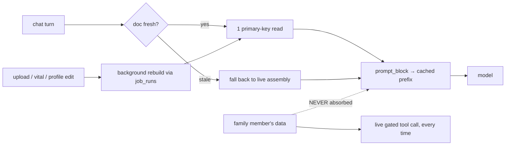

# One memory per user — can it be done, and what breaks at 10M?

**Yes, and it is smaller than you think.** Davi already stores per-user memory
in eleven places. "One memory per user" is mostly assembling what exists,
adding the document insights and trends you want, and reading it once instead
of twenty-six times. Everything a person would call *memory* — profile, topics,
episodes, insights, pedigree — is **13.7 KB per user**. At 10M users that is
**~12 GB**.

**And no, the memory is not what gets hard at 1M–10M users.** It is not even in
the top three. This analysis went looking for the scaling wall and found it
somewhere else entirely:

| # | What actually breaks first | At | Fix |
|---|---|---|---|
| **1** | **A database connection is held across the LLM call.** `app/api/v1/chat.py:78` commits *after* `handle_chat` returns, so an open transaction spans the ~3 s model call. Pool default is 15/process. That needs ~167 concurrent connections at 1M and **~1,667 at 10M** — on a database shared with mhn-spring and mhn-ai. | **~1M** | Move the commit before the LLM call. ~60 lines. **120× the headroom.** |
| **2** | **The prompt bill.** At 10M users the *system prompt alone* is **$1.35M/month** (Haiku 4.5) to **$4.06M/month** (Sonnet 5), plus $469K–$1.41M output. Per-user memory is only 7–17% of it. | 1M–10M | Make caching actually work (see §3) — it does not today. |
| **3** | **9.94 TB/year of transcript and audit log**, with no cap, no retention, no delete path. 97.5% of Davi's per-user bytes. `rag_turn_receipts` alone is 4.38B rows/yr — **and no code path reads it.** | ~1M | A 180-day retention policy. |
| — | The memory layer itself | never | 12 GB at 10M |

So: **build the memory — it is cheap and it closes a real correctness bug — but
fix the commit placement first**, or you have a tidier read path in front of a
wall that arrives at 1M regardless.

---

## 1. Two findings that change the economics before we start

### 1.1 Prompt caching is off on the default engine

`CHAT_ENGINE` defaults to `legacy` (`app/config.py:52`). The legacy path calls
`provider.generate(system=<plain string>)` (`app/chat/orchestrator.py:786`), and
a plain string passes through `_to_system_blocks` untouched — **no
`cache_control`, no breakpoint, nothing cached.** The Task 23 caching work
applies only to the agentic engine, which is not the default.

That means today's legacy system prompt — 3,709 tokens — is paid in full on
every single turn.

### 1.2 On the documented production model, caching cannot work at all

`railway.toml:44` documents `LLM_MODEL=claude-haiku-4-5`. The minimum cacheable
prefix is **per model**, and Haiku 4.5's is **4,096 tokens**:

| Model | Minimum prefix | Our ~2,541-token prefix |
|---|---:|---|
| Opus 5 | 512 | caches |
| Sonnet 5 | 1,024 | caches |
| **Haiku 4.5** | **4,096** | **caches nothing — and returns no error** |

*(Verified against Anthropic's prompt-caching documentation, Aug 2026.)*

Adding a per-user memory block would raise the cumulative prefix to ~3,264
tokens — still short of 4,096. **No arrangement of the current prompt caches on
Haiku 4.5.** That is an argument for choosing a different model, not for
padding the prompt with more of the reader's PHI to reach a threshold.

Run `python -m scripts.cache_probe --model <model>` before quoting any saving.

---

## 2. What Davi has today

| # | Store | Holds | Bytes/user |
|---|---|---|---:|
| 1 | `user_profiles` | Self-reported conditions, meds, allergies, goals | 238 |
| 2 | `user_memories` | Discussion topics + flags, deduped | 3,586 |
| 3 | `conversation_summaries` | Per-**session** compaction | 0 * |
| 4 | `active_symptom_states` | Open symptom episodes | 624 |
| 5 | `insight_artifacts` | Family-history insights | 5,832 |
| 6 | `pedigree_*` | Family history | 2,886 |
| 7 | `consent_ledger` | Grants | 552 |
| 8–11 | Core Flyway tables | Documents, vitals, labs, meds, lifestyle — **read live, never stored** | — |
| | **"Memory" total** | | **13,711 B** |
| | `conversation_messages` + `rag_turn_receipts` | transcript + audit | **969 KB/yr** |

\* *Under an assumed 12 messages/session, `maybe_compact` never fires —
`COMPACT_THRESHOLD` is 20 (`app/chat/conversation.py:23`). So
`COMPACTED_CONTEXT_JSON` contributes zero tokens in practice until sessions get
longer than assumed.*

**The memory is 1.4% of the bytes. The transcript is 97.5%.**

### Measured: what a turn costs today

| Turn type | SQL statements |
|---|---:|
| Legacy, educational | 14–17 |
| Legacy, personal symptom | 25 |
| Agentic, personal symptom | **26** |

*(Measured with a SQL event listener over real `handle_chat` turns.)*

Four of those are the same `vital_reading` query with different parameters — an
N+1. And nine reads across the codebase use `ORDER BY` with **no `LIMIT`**,
then take `.first()` in Python; `AsyncSession.execute` buffers, so every
matching row crosses the wire to keep one. That cost scales with **user
tenure**, which worsens over exactly the period your user base grows.

### Measured: what reaches the model

| Block | Tokens | Cached today? |
|---|---:|---|
| Tool schemas *(agentic only)* | ~1,691 | agentic: yes · legacy: n/a |
| System rules | ~850 | agentic: yes · **legacy: no** |
| Retrieved knowledge | ~1,038 | no |
| Conversation history | ~698 | no — *and it is in the system prompt* |
| Profile · recall · episodes · `[P]` | ~486 | no |
| *Document insights + trends (what you want)* | *~237* | *no* |

*(Derived from a chars/3.5 ratio over really-rendered blocks; the 2,541 prefix
is confirmed by inspecting a live call.)*

---

## 3. The recommended design

One row per user, rebuilt on write, read with one primary-key lookup — plus the
prompt-layout changes, which are worth more than the table.

### 3.1 The table

```sql
CREATE TABLE IF NOT EXISTS public.user_memory_document (
    id             uuid PRIMARY KEY,
    user_id        uuid NOT NULL,          -- no FK; Davi convention
    document       jsonb NOT NULL,         -- the snapshot
    prompt_block   text NOT NULL,          -- pre-rendered, BYTE-STABLE
    source_hash    varchar(64) NOT NULL,   -- what it was built from
    built_at       timestamptz NOT NULL,
    schema_version smallint NOT NULL DEFAULT 1
);
CREATE UNIQUE INDEX IF NOT EXISTS uq_user_memory_document
    ON public.user_memory_document (user_id);
```

At 10M users, one row each: **~12 GB**, and it does not grow with time.

Two fields carry the design. **`prompt_block`** is rendered at write time and is
byte-stable between rebuilds — that is what lets it sit behind a cache
breakpoint. **`source_hash`** means identical inputs produce no write, mirroring
`insight_artifacts.content_hash`.

The document is **derived and rebuildable**. Losing it costs a rebuild, never
data.

### 3.2 What goes in — and what must not

```json
{
  "profile":   {"age_band": "55_64", "conditions": ["type 2 diabetes"],
                "medications": ["metformin 1000mg"], "pregnant": false},
  "own_labs":  [{"test": "HbA1c", "value": 7.4, "unit": "%", "flag": "high",
                 "on": "2026-08-12", "doc_id": 8821}],
  "trends":    [{"metric": "HbA1c", "from": 6.9, "to": 7.4,
                 "since": "2026-01-04", "direction": "up"}],
  "documents": [{"id": 8821, "title": "Lipid Profile", "on": "2026-08-12"}],
  "habits":    {"steps_30d_avg": 3200, "sleep_30d_avg_hours": 6.1},
  "episodes":  [{"symptom": "headache", "open_days": 9}],
  "topics":    ["diabetes", "cholesterol"]
}
```

**Only the user's own data. Never another person's** — see §5.1. Every entry
carries provenance (`doc_id`, `on`) so replies can cite it and a stale entry is
traceable.

**Bound it at ~900 prompt tokens.** Above that it starts evicting retrieved
knowledge from the 6,000-token volatile budget, and every token is charged on
every turn forever.

### 3.3 The prompt changes that matter more than the table

**(a) Give the legacy engine a breakpoint at all.** It has none today (§1.1).

**(b) A second breakpoint after the per-user block.** Anthropic allows four,
and each caches the *cumulative* prefix, so a breakpoint after the memory block
caches tools + rules + *this reader's memory* as one prefix. The change is
small: `_to_system_blocks` marks only element 0 today
(`app/llm/anthropic.py:205`); it would mark elements 0 and 1 of a three-element
split.

**(c) Move conversation history out of the system prompt into `messages`.**
Davi sends **one** user message and stuffs history into the system prompt as
text (`app/chat/orchestrator.py:1116`) — ~698 uncacheable tokens per turn, and
it defeats the standard multi-turn caching pattern.

| Layout | Tokens / 4-turn session | vs today |
|---|---:|---:|
| Today | 13,587 | — |
| + 2nd breakpoint on per-user memory | 11,815 | −13% |
| + history moved into `messages` | **9,128** | **−33%** |

*(Derived, at Anthropic's 1.25× write / 0.1× read multipliers.)*

Neither change alters what the model is told. **All three are worth doing
whether or not you build the memory document — and none of them help on Haiku
4.5 (§1.2).**

### 3.4 The read and write paths



Rebuild **in the background**, on the events that change the document — not on
a timer, and never on read. A lazy rebuild inside the request would put
document-processing latency on the chat path, and worse, inside the transaction
that already holds a connection across the LLM call.

**Failure mode:** missing, stale, or unavailable → fall back to today's live
assembly. Slower, correct, already written. Memory is an optimisation with a
cached answer, never a new way for the chat to break.

---

## 4. Scale

| | 10K | 100K | 1M | 10M |
|---|---:|---:|---:|---:|
| Memory document | 12 MB | 119 MB | 1.2 GB | **11.9 GB** |
| Transcript + receipts (yr 1) | 9.9 GB | 99 GB | 994 GB | **9.94 TB** |
| If instead: 20 memories/user embedded @1024-d | 1.6 GB | 15.8 GB | 158 GB | **1,575 GB** |
| Peak concurrent DB connections *(today)* | 1.7 | 16.7 | **167** | **1,667** |
| Peak concurrent connections *(commit moved)* | 0.0 | 0.1 | 1.4 | **13.9** |
| System-prompt bill/month, Haiku 4.5 | $1.4K | $13.5K | $135K | **$1.35M** |
| System-prompt bill/month, Sonnet 5 | $4.1K | $40.6K | $406K | **$4.06M** |

*(Storage and connections derived — 20% DAU, 6 turns/day, 4× diurnal peak, 3 s
turn. Prices are Anthropic's published rates. None of this is a measurement of
production traffic.)*

Read the connection row twice. **A commit-placement change moves the wall from
~1M to well past 10M.** Nothing else in this document buys an order of
magnitude.

---

## 5. The three genuinely hard parts

### 5.1 Consent revocation — the constraint that shapes the design

Davi checks family read permission **live, on every document read**
(`app/coredata/service.py::can_view_document`): accepted connection + owner-side
`req_read`/`acc_read` + not private + no `file_access_exclusions` row. Nothing
is cached, so revocation takes effect on the next request.

A materialized document breaks that the moment it absorbs someone else's data.

> **Failure scenario.** Priya's father shares his reports. Her memory document
> absorbs *"father's HbA1c 8.1% on 12 Aug, trending up."* In September he
> revokes sharing. She asks how his sugar is doing. The live gate now says no —
> but the memory already said it, in the prompt, before any tool ran. The model
> answers from memory. **The revocation did nothing.**

**So: a user's memory document holds only that user's own data.** Family data
stays a live, gated tool call, every time. One extra query on the minority of
turns that ask about a relative, in exchange for a permission check that stays
correct.

### 5.2 Erasure — "forget me" is weaker than it looks

`forget_everything` (`app/chat/profile.py:210`) deletes `user_profiles`,
`user_memories` and `turn_feedback` — **3 of 11 stores.** Episodes, insights,
pedigree, sessions, messages, summaries and receipts all survive it.

A memory document makes this worse before it makes it better, and an
adversarial review named the trap precisely:

> **Failure scenario.** A user calls forget-me. The document row is deleted. The
> user sends one more message. The rebuild runs, reads the *sources that were
> never deleted*, and reconstructs the memory. **Erasure became cache
> invalidation.**

Fix the sources first. `conversation_sessions` cascades to messages *and*
summaries (`app/models/chat.py:76,89`), so **one** additional `DELETE` takes
coverage from 3/11 to 10/11. Do that before the document exists, not after.

### 5.3 Staleness — telling a patient something untrue

> **Failure scenario.** Memory says *"HbA1c 7.4%, trending up."* A new report on
> Tuesday shows 6.8%. The rebuild fails silently. On Thursday the reader asks
> "is my sugar improving?" and is told it is getting worse — citing a number
> that is real, was true, and is now wrong.

1. **Timestamp everything in the prompt block.** *"HbA1c 7.4% (12 Aug)"* is
   honest in a way the bare number is not.
2. **A freshness ceiling** — past it, fall back to live assembly rather than
   serve a document you do not trust.
3. **Rebuild on the write.** A document processed at 14:02 rebuilds at 14:02.

The numeric-fidelity guard does not help here: it checks that a value traces to
*a* source, not that the source is current.

---

## 6. What NOT to build

- **Per-user vector search.** ~1,575 GB at 10M users, wanting to be in RAM, on a
  shared database. And it buys nothing: vector search finds needles in
  haystacks, and a user's memory is 20–200 items. `user_id` already did the only
  partitioning that matters, and what survives the prompt budget fits anyway —
  the ranking that matters is *what fits*, not *what is nearest*. Revisit only
  above ~10,000 live items per user, which a health record will not reach.
- **A separate memory service or vector database.** Nothing here needs one, and
  the schema is owned by another team's Flyway chain.
- **Redis in front of the document.** A primary-key read of a 2 KB row is
  already fast. Add a cache when a measurement says the read is the problem.
- **LLM-written memory summaries.** This puts a model in the write path of the
  reader's health record, and a hallucinated memory persists and gets cited
  later. Deterministic assembly keeps memory auditable — the same reason the
  insights engine has no LLM in it.
- **PgBouncer, until the commit moves.** Transaction mode cannot pool a
  transaction that spans the LLM call. Afterwards it is optional.
- **Padding the prompt to 4,096 tokens to make Haiku cache.** It technically
  works and it means sending 2.5× more of the reader's PHI on every turn to hit
  a billing threshold. Change the model instead.

---

## 7. The order to do things in

| Rung | Do | Trigger | Why |
|---|---|---|---|
| **0** | **Move the commit before the LLM call.** Plus `.limit(1)` on the nine unbounded reads, and the one `DELETE` that takes forget-me to 10/11. | **Now** | ~60 lines. 120× connection headroom. Moves the wall from 1M to past 10M. |
| **1** | Fix `list_sessions` — it `GROUP BY`s the entire `conversation_messages` table with no user predicate before `LIMIT 50` applies. | ~100K | A plain query bug on a UI endpoint. No migration. |
| **2** | 180-day retention on `rag_turn_receipts` and `conversation_messages`. Keyset-paginate `nightly_sweep` (today one transaction, serial loop — ~1.4 h at 1M, ~14 h at 10M, blocking autovacuum). | before 1M | 97.5% of the bytes. |
| **3** | The prompt-cache work — **after** the production model is chosen, and verified with `scripts/cache_probe.py`. | 100K–1M | Zero benefit on Haiku 4.5. |
| **4** | **The memory document**, read from the shared prologue. | ~1M, or sooner for the feature | Not for query count — for byte-stability (rung 3's prerequisite), for the doc-insights feature, and for the correctness bug below. |
| **5** | Partition `rag_turn_receipts` (~1.1M) · read replica (~1.7M) · archive cold users (~3M) · tier memory by recency (block > 900 tokens). | as triggered | The boring answers, at their real triggers. |

**A correctness bug rung 4 closes:** `get_profile` and `open_episodes` are
called only from the agentic path (`orchestrator.py:1059,1070`), while `recall`
and `record_topics` are called only from the legacy path (`:666-667`). **On
either engine, at least one memory store is silently dead.** One assembly
function read from the shared prologue fixes that as a side effect.

---

## 8. Decisions I need from you

| # | Question | Recommendation |
|---|---|---|
| 1 | **Which production model?** | This is the highest-leverage decision in the document. On Haiku 4.5 no caching is possible and the bill is $1.35M/mo at 10M; on Sonnet 5 caching works but the base rate is 3×. Decide it before rung 3. |
| 2 | How many past documents in memory? | **Last 5, plus trends.** Each adds ~50 tokens/turn forever — ~$44K/year at 1M users. |
| 3 | Freshness tolerance before falling back to live assembly? | **1 hour.** |
| 4 | Its own consent grant, or reuse `chat_personalization`? | **Reuse.** Same purpose; a second grant is a second thing to revoke and get wrong. |
| 5 | Show the user what Davi remembers? | **Yes, eventually** — editable. Cheapest trust mechanism available, and DPDP-friendly. Not stage 1. |
| 6 | Is 20% DAU / 6 turns/day right? | Every number here scales linearly with it. Substitute real figures and the *shape* holds. |

---

## Appendix — provenance

| Number | How |
|---|---|
| 14–26 SQL statements/turn | **Measured** — SQL event listener over real `handle_chat` |
| 2,541-token prefix; the split the orchestrator ships | **Measured** — inspected what the provider receives |
| Per-block token counts | **Derived** — chars/3.5 over really-rendered blocks |
| Cache multipliers, 4 breakpoints, cumulative prefixes, per-model minimums | **Verified** — Anthropic docs, Aug 2026 |
| Commit-after-LLM; pool 5+10; legacy sends a plain string | **Verified** — read at `chat.py:78`, `db.py:33`, `orchestrator.py:786` |
| Storage, connections, bills | **Derived** — arithmetic from stated assumptions |
| DAU, turns/day, peak factor, prices | **Assumed / published** — stated at each table |

Nothing here measures production traffic. The scripts are in the session
scratchpad and can be re-run against real figures.
